# Wave 2 AI-Enhanced Personal Finance Intelligence System Architecture

## Executive Summary

This architectural blueprint outlines the comprehensive design for Wave 2 AI features, building upon the robust Wave 1 foundation. The system integrates advanced machine learning capabilities with the existing financial infrastructure to deliver intelligent, personalized financial insights and automated optimization.

### Key Architectural Decisions
- **Hybrid AI Architecture**: Local LLM for privacy-critical operations + cloud ML for complex analytics
- **Event-Driven ML Pipeline**: Real-time feature engineering with Apache Kafka integration
- **Federated Learning**: Privacy-preserving model training across user data
- **Microservices Extension**: AI services as independent, scalable components
- **Performance Targets**: Maintain <400ms response times with intelligent caching

## System Architecture Overview

```mermaid
graph TB
    %% User Layer
    User[👤 User] --> WebApp[🌐 Web App<br/>Next.js 15 + AI Components]
    User --> MobileApp[📱 Mobile App<br/>React Native + AI SDK]

    %% API Gateway Layer (Enhanced)
    WebApp --> Gateway[⚡ API Gateway<br/>Hasura + AI Orchestration<br/>Port: 8081]
    MobileApp --> Gateway

    %% AI Intelligence Layer (NEW)
    Gateway --> AIOrchestrator[🧠 AI Orchestrator<br/>Request Router & Cache<br/>Port: 8084]
    AIOrchestrator --> LocalLLM[🤖 Local LLM Service<br/>Llama 3.1 Fine-tuned<br/>Port: 8085]
    AIOrchestrator --> MLPipeline[📊 ML Pipeline Service<br/>Feature Engineering<br/>Port: 8086]
    AIOrchestrator --> OptimizationEngine[⚡ Optimization Service<br/>Portfolio & Debt AI<br/>Port: 8087]

    %% Existing Core Services
    Gateway --> RustFinancial[🦀 Rust Financial Engine<br/>Calculations<br/>Port: 8080]
    Gateway --> PostgreSQL[(🗄️ PostgreSQL<br/>Primary Data<br/>Port: 5432)]

    %% ML Infrastructure (NEW)
    MLPipeline --> FeatureStore[(📊 Feature Store<br/>TimescaleDB<br/>Port: 5433)]
    MLPipeline --> ModelRegistry[📦 Model Registry<br/>MLflow<br/>Port: 8088]
    MLPipeline --> VectorDB[(🔍 Vector DB<br/>Qdrant<br/>Port: 6333)]

    %% Event Streaming (NEW)
    EventBus[📨 Event Bus<br/>Kafka/Redis Streams<br/>Port: 9092] --> MLPipeline
    RustFinancial --> EventBus
    Gateway --> EventBus

    %% Market Data Integration (NEW)
    MarketData[📈 Market Data Service<br/>Real-time Feed<br/>Port: 8089] --> EventBus
    MarketData --> DataProviders[🏦 Data Providers<br/>Alpha Vantage/Polygon]

    %% Monitoring & Observability (Enhanced)
    subgraph "Observability Stack"
        Prometheus[📊 Prometheus<br/>Metrics]
        Grafana[📈 Grafana<br/>Dashboards]
        MLMonitor[🔍 ML Monitor<br/>Model Performance]
    end

    %% Styling
    classDef aiLayer fill:#e3f2fd
    classDef mlLayer fill:#f3e5f5
    classDef dataLayer fill:#fff8e1
    classDef existing fill:#e8f5e8

    class AIOrchestrator,LocalLLM,MLPipeline,OptimizationEngine aiLayer
    class FeatureStore,ModelRegistry,VectorDB,MLMonitor mlLayer
    class PostgreSQL,EventBus,MarketData dataLayer
    class Gateway,RustFinancial existing
```



## Component Architecture Details

### 1. AI Orchestration Layer

```yaml
AI_Orchestrator:
  purpose: "Central routing and coordination for all AI requests"
  port: 8084
  technology:
    - FastAPI with async support
    - Redis for request caching
    - Circuit breaker pattern for resilience
  
  responsibilities:
    - Request classification and routing
    - Response caching and optimization
    - Load balancing across AI services
    - Fallback strategies for service failures
    - A/B testing for model variations
  
  integrations:
    - Hasura GraphQL (upstream)
    - All AI microservices (downstream)
    - Redis cache layer
    - Monitoring stack
```

### 2. Smart Budgeting AI Service

```yaml
Smart_Budgeting_AI:
  endpoint: /api/ai/budget
  models:
    - Spending Pattern Recognition (LSTM)
    - Category Optimization (Reinforcement Learning)
    - Anomaly Detection (Isolation Forest)
    - Budget Recommendation (XGBoost)
  
  features:
    real_time:
      - Transaction categorization with 95%+ accuracy
      - Spending alerts with predictive thresholds
      - Dynamic budget adjustments based on patterns
    
    batch_processing:
      - Monthly spending analysis and insights
      - Category-wise optimization recommendations
      - Peer comparison (anonymized)
      - Seasonal trend predictions
  
  data_pipeline:
    input:
      - Transaction history (90 days minimum)
      - Budget allocations and goals
      - User preferences and constraints
    
    processing:
      - Feature engineering (200+ features)
      - Model inference (<100ms)
      - Result caching (1 hour TTL)
    
    output:
      - Optimized budget allocations
      - Savings opportunities (ranked)
      - Risk alerts and recommendations
```

### 3. Goal Achievement Intelligence

```yaml
Goal_Intelligence_Service:
  endpoint: /api/ai/goals
  models:
    - Goal Feasibility Predictor (Gradient Boosting)
    - Milestone Optimizer (Dynamic Programming)
    - Motivation Engine (Behavioral Model)
    - Success Probability Calculator (Bayesian)
  
  capabilities:
    predictive_analytics:
      - Goal completion probability with confidence intervals
      - Optimal milestone scheduling
      - Resource allocation recommendations
      - Alternative path suggestions
    
    behavioral_insights:
      - Personalized motivation strategies
      - Habit formation recommendations
      - Progress gamification elements
      - Social proof integration (opt-in)
  
  integration_points:
    - Budget AI for resource availability
    - Investment AI for growth projections
    - Debt AI for obligation considerations
    - Market Data for realistic projections
```

### 4. Investment Portfolio AI

```yaml
Portfolio_AI_Service:
  endpoint: /api/ai/portfolio
  models:
    - Risk Profile Analyzer (Neural Network)
    - Portfolio Optimizer (Markowitz + ML)
    - Market Prediction (Ensemble Methods)
    - Rebalancing Engine (Reinforcement Learning)
  
  automated_features:
    continuous_monitoring:
      - Real-time risk assessment
      - Drift detection and alerts
      - Correlation analysis updates
      - Performance attribution
    
    intelligent_rebalancing:
      - Tax-aware optimization
      - Transaction cost minimization
      - Risk-adjusted recommendations
      - Market timing indicators
    
    personalization:
      - Dynamic risk profiling
      - Goal-aligned allocations
      - ESG preference integration
      - Custom constraint handling
```

### 5. Debt Payoff Intelligence

```yaml
Debt_Intelligence_Service:
  endpoint: /api/ai/debt
  models:
    - Payment Optimizer (Linear Programming + ML)
    - Interest Predictor (Time Series)
    - Consolidation Analyzer (Decision Tree)
    - Credit Score Estimator (Random Forest)
  
  optimization_strategies:
    ml_enhanced_algorithms:
      - AI-powered snowball (psychological factors)
      - Smart avalanche (interest rate predictions)
      - Hybrid approach (personalized blend)
      - Cash flow optimization
    
    predictive_features:
      - Early payoff impact analysis
      - Refinancing opportunity detection
      - Credit score improvement timeline
      - Emergency fund balance recommendations
```

## Data Architecture

### ML Pipeline Architecture

```mermaid
graph LR
    %% Data Sources
    subgraph "Data Sources"
        Transactions[💳 Transactions]
        Accounts[🏦 Accounts]
        Markets[📈 Market Data]
        UserEvents[👤 User Events]
    end

    %% Stream Processing
    subgraph "Stream Processing"
        Kafka[📨 Kafka Streams]
        FeatureEng[⚙️ Feature Engineering]
        Aggregation[📊 Aggregations]
    end

    %% Storage
    subgraph "ML Storage"
        FeatureStore[(📊 Feature Store<br/>TimescaleDB)]
        ModelRegistry[📦 Model Registry<br/>MLflow]
        VectorStore[(🔍 Vector Store<br/>Qdrant)]
    end

    %% ML Services
    subgraph "ML Services"
        Training[🎯 Model Training]
        Inference[⚡ Model Inference]
        Monitoring[📊 Model Monitoring]
    end

    %% Flow
    Transactions --> Kafka
    Accounts --> Kafka
    Markets --> Kafka
    UserEvents --> Kafka

    Kafka --> FeatureEng
    FeatureEng --> Aggregation
    Aggregation --> FeatureStore

    FeatureStore --> Training
    Training --> ModelRegistry
    ModelRegistry --> Inference
    
    FeatureStore --> Inference
    Inference --> VectorStore
    
    Inference --> Monitoring
    Monitoring --> ModelRegistry
```



### Feature Store Schema

```sql
-- Time-series features table (TimescaleDB hypertable)
CREATE TABLE ml_features (
    user_id UUID NOT NULL,
    feature_name TEXT NOT NULL,
    feature_value NUMERIC,
    feature_vector FLOAT[],
    computed_at TIMESTAMPTZ NOT NULL,
    model_version TEXT,
    PRIMARY KEY (user_id, feature_name, computed_at)
);

-- Convert to hypertable for time-series optimization
SELECT create_hypertable('ml_features', 'computed_at');

-- Model metadata table
CREATE TABLE ml_models (
    model_id UUID PRIMARY KEY,
    model_name TEXT NOT NULL,
    model_type TEXT NOT NULL,
    version TEXT NOT NULL,
    accuracy_metrics JSONB,
    feature_importance JSONB,
    training_completed_at TIMESTAMPTZ,
    deployment_status TEXT,
    created_at TIMESTAMPTZ DEFAULT NOW()
);

-- Prediction audit trail
CREATE TABLE ml_predictions (
    prediction_id UUID PRIMARY KEY,
    user_id UUID NOT NULL,
    model_id UUID REFERENCES ml_models(model_id),
    prediction_type TEXT NOT NULL,
    input_features JSONB,
    prediction_result JSONB,
    confidence_score NUMERIC,
    created_at TIMESTAMPTZ DEFAULT NOW()
);
```

## Security Architecture

### AI-Specific Security Measures

```yaml
Model_Security:
  data_privacy:
    - Differential privacy for model training
    - Federated learning for sensitive data
    - Data anonymization pipelines
    - PII detection and removal
  
  model_protection:
    - Model encryption at rest
    - Secure model serving with authentication
    - Input validation and sanitization
    - Output filtering for sensitive data
  
  adversarial_defense:
    - Input perturbation detection
    - Model robustness testing
    - Anomaly detection on inputs
    - Rate limiting per user/model

Access_Control:
  authentication:
    - JWT validation (inherited from SuperTokens)
    - Service-to-service mTLS
    - API key management for external services
  
  authorization:
    - Feature-level permissions
    - Model access control
    - Data scope limitations
    - Audit trail for all predictions

Compliance:
  regulations:
    - GDPR compliance for ML models
    - Right to explanation implementation
    - Model bias monitoring
    - Financial regulation adherence
  
  auditing:
    - Complete prediction lineage
    - Model decision logging
    - Performance metrics tracking
    - Compliance reporting automation
```

## Performance Architecture

### Optimization Strategies

```yaml
Caching_Layer:
  redis_cache:
    - Model predictions (TTL: 1 hour)
    - Feature vectors (TTL: 24 hours)
    - Market data (TTL: 5 minutes)
    - User preferences (TTL: 7 days)
  
  edge_caching:
    - CDN for static model assets
    - Regional model serving
    - Progressive web app caching

Computation_Optimization:
  model_serving:
    - ONNX runtime for inference
    - Model quantization (INT8)
    - Batch prediction API
    - GPU acceleration for complex models
  
  async_processing:
    - Background job queue (Celery)
    - Event-driven architecture
    - Parallel feature computation
    - Stream processing for real-time

Performance_Targets:
  latency:
    - P50: <100ms
    - P95: <300ms
    - P99: <400ms
  
  throughput:
    - 10,000 predictions/second
    - 100,000 feature computations/second
    - 1M events/second ingestion
  
  resource_efficiency:
    - <2GB RAM per service
    - <20% CPU baseline
    - Auto-scaling triggers at 70%
```

## Integration Patterns

### Wave 1 System Integration

```yaml
Budget_System_Integration:
  existing_components:
    - BudgetDashboard.tsx
    - BudgetAllocationInterface.tsx
    - Budget GraphQL queries
  
  ai_enhancements:
    - SmartBudgetRecommendations component
    - AI-powered allocation suggestions
    - Predictive spending alerts
    - Anomaly detection overlays

Goals_System_Integration:
  existing_components:
    - GoalDashboard.tsx
    - GoalProgressCard.tsx
    - Goal tracking logic
  
  ai_enhancements:
    - GoalFeasibilityIndicator component
    - AI milestone optimizer
    - Success probability display
    - Alternative path suggestions

Investment_Integration:
  existing_components:
    - InvestmentDashboard.tsx
    - Portfolio calculations (Rust)
    - Risk analysis functions
  
  ai_enhancements:
    - AIPortfolioOptimizer component
    - Automated rebalancing alerts
    - Market prediction insights
    - Risk-adjusted recommendations

Debt_Integration:
  existing_components:
    - DebtDashboard.tsx
    - DebtPayoffCalculator.tsx
    - Debt optimization (Rust)
  
  ai_enhancements:
    - SmartDebtStrategy component
    - ML-enhanced payoff plans
    - Refinancing opportunity alerts
    - Credit score predictions
```

## Deployment Architecture

### Kubernetes Deployment Strategy

```yaml
apiVersion: apps/v1
kind: Deployment
metadata:
  name: ai-orchestrator
  namespace: atlas-financial
spec:
  replicas: 3
  selector:
    matchLabels:
      app: ai-orchestrator
  template:
    metadata:
      labels:
        app: ai-orchestrator
    spec:
      containers:
      - name: ai-orchestrator
        image: atlas-financial/ai-orchestrator:latest
        ports:
        - containerPort: 8084
        resources:
          requests:
            memory: "1Gi"
            cpu: "500m"
          limits:
            memory: "2Gi"
            cpu: "1000m"
        env:
        - name: REDIS_URL
          valueFrom:
            secretKeyRef:
              name: redis-credentials
              key: url
        - name: ML_PIPELINE_URL
          value: "http://ml-pipeline-service:8086"
        livenessProbe:
          httpGet:
            path: /health
            port: 8084
          initialDelaySeconds: 30
          periodSeconds: 10
---
apiVersion: v1
kind: Service
metadata:
  name: ai-orchestrator-service
  namespace: atlas-financial
spec:
  selector:
    app: ai-orchestrator
  ports:
  - protocol: TCP
    port: 8084
    targetPort: 8084
  type: ClusterIP
---
apiVersion: autoscaling/v2
kind: HorizontalPodAutoscaler
metadata:
  name: ai-orchestrator-hpa
  namespace: atlas-financial
spec:
  scaleTargetRef:
    apiVersion: apps/v1
    kind: Deployment
    name: ai-orchestrator
  minReplicas: 2
  maxReplicas: 10
  metrics:
  - type: Resource
    resource:
      name: cpu
      target:
        type: Utilization
        averageUtilization: 70
  - type: Resource
    resource:
      name: memory
      target:
        type: Utilization
        averageUtilization: 80
```

### CI/CD Pipeline for ML

```yaml
ML_Pipeline:
  training_pipeline:
    - Data validation and quality checks
    - Feature engineering and selection
    - Model training with hyperparameter tuning
    - Model evaluation and validation
    - A/B testing setup
    - Gradual rollout strategy
  
  deployment_pipeline:
    - Model containerization
    - Integration testing
    - Performance benchmarking
    - Security scanning
    - Canary deployment
    - Monitoring setup
  
  monitoring_pipeline:
    - Model drift detection
    - Performance degradation alerts
    - Data quality monitoring
    - Retraining triggers
    - Rollback procedures
```

## Technology Stack Additions

### AI/ML Specific Technologies

```yaml
Machine_Learning:
  frameworks:
    - PyTorch (deep learning models)
    - Scikit-learn (traditional ML)
    - XGBoost (gradient boosting)
    - Ray (distributed training)
  
  model_serving:
    - TorchServe (PyTorch models)
    - ONNX Runtime (optimized inference)
    - Triton Inference Server (GPU)
  
  mlops:
    - MLflow (experiment tracking)
    - DVC (data versioning)
    - Kubeflow (ML workflows)
    - Weights & Biases (monitoring)

Data_Processing:
  stream_processing:
    - Apache Kafka (event streaming)
    - Apache Flink (complex events)
    - Redis Streams (lightweight)
  
  feature_store:
    - Feast (feature serving)
    - TimescaleDB (time-series)
    - Apache Cassandra (scale)
  
  vector_database:
    - Qdrant (neural search)
    - Pinecone (managed option)
    - Weaviate (hybrid search)

Infrastructure:
  compute:
    - NVIDIA T4 GPUs (inference)
    - CPU optimized instances
    - Spot instances for training
  
  storage:
    - S3-compatible object storage
    - NVMe SSDs for models
    - Distributed file system
```

## Implementation Roadmap

### Phase 2.1: Foundation (Weeks 1-4)
1. **AI Orchestrator Service**
   - Basic routing and caching
   - Integration with existing services
   - Performance benchmarking

2. **ML Pipeline Infrastructure**
   - Kafka deployment
   - Feature store setup
   - Model registry initialization

3. **Local LLM Service**
   - Llama 3.1 deployment
   - Fine-tuning pipeline
   - API integration

### Phase 2.2: Smart Features (Weeks 5-8)
1. **Smart Budgeting AI**
   - Transaction categorization model
   - Spending pattern analysis
   - Recommendation engine

2. **Goal Achievement Intelligence**
   - Feasibility prediction model
   - Milestone optimization
   - Progress tracking enhancements

### Phase 2.3: Advanced Features (Weeks 9-12)
1. **Investment Portfolio AI**
   - Market data integration
   - Portfolio optimization models
   - Automated rebalancing logic

2. **Debt Payoff Intelligence**
   - ML-enhanced algorithms
   - Credit score predictions
   - Refinancing detection

### Phase 2.4: Production Readiness (Weeks 13-16)
1. **Performance Optimization**
   - Model quantization
   - Caching strategies
   - Load testing

2. **Security Hardening**
   - Penetration testing
   - Compliance validation
   - Audit trail completion

3. **Monitoring & Observability**
   - ML-specific metrics
   - Drift detection
   - Automated alerts

## Success Metrics

### Technical Metrics
- **Latency**: P95 < 400ms for all AI endpoints
- **Accuracy**: >90% for categorization, >80% for predictions
- **Availability**: 99.9% uptime for AI services
- **Scalability**: Support 10,000 concurrent users

### Business Metrics
- **User Engagement**: 50% increase in feature usage
- **Financial Outcomes**: 20% improvement in budget adherence
- **Goal Success**: 30% higher goal completion rates
- **Debt Reduction**: 25% faster payoff times

### ML Metrics
- **Model Performance**: Regular A/B testing victories
- **Data Quality**: <1% missing features
- **Retraining Frequency**: Weekly for critical models
- **Inference Cost**: <$0.001 per prediction

## Risk Mitigation

### Technical Risks
1. **Model Degradation**
   - Continuous monitoring
   - Automated retraining
   - Fallback to rule-based systems

2. **Scalability Issues**
   - Horizontal scaling design
   - Caching at multiple levels
   - Progressive enhancement

3. **Integration Complexity**
   - Phased rollout approach
   - Feature flags for control
   - Comprehensive testing

### Business Risks
1. **User Trust**
   - Explainable AI features
   - Transparency in recommendations
   - User control over AI features

2. **Regulatory Compliance**
   - Regular compliance audits
   - Data privacy by design
   - Clear documentation

## Conclusion

This Wave 2 architecture provides a comprehensive blueprint for integrating advanced AI capabilities into the Atlas Financial platform. The design prioritizes performance, security, and user value while maintaining the flexibility to evolve with emerging AI technologies and user needs.

The modular approach ensures that each AI service can be developed, deployed, and scaled independently, while the unified orchestration layer provides seamless integration with the existing Wave 1 infrastructure.