# Wave 2 AI System - Detailed Component Breakdown

## Component Architecture by Feature Area

### 1. Smart Budgeting AI Components

```mermaid
graph TB
    subgraph "Frontend Components"
        SmartBudgetDashboard[📊 SmartBudgetDashboard<br/>AI-Enhanced Dashboard]
        BudgetInsights[💡 BudgetInsights<br/>ML Recommendations]
        SpendingPredictor[📈 SpendingPredictor<br/>Future Spend Forecast]
        AnomalyAlert[🚨 AnomalyAlert<br/>Unusual Activity]
        CategoryOptimizer[🎯 CategoryOptimizer<br/>Smart Allocations]
    end

    subgraph "API Layer"
        BudgetAIEndpoint[🔌 /api/ai/budget<br/>GraphQL Resolver]
        StreamEndpoint[📡 /api/ai/budget/stream<br/>Real-time Updates]
    end

    subgraph "ML Services"
        PatternRecognition[🧠 Pattern Recognition<br/>LSTM Model]
        CategoryClassifier[🏷️ Category Classifier<br/>BERT-based NLP]
        OptimizationEngine[⚡ Optimization Engine<br/>Reinforcement Learning]
        AnomalyDetector[🔍 Anomaly Detector<br/>Isolation Forest]
    end

    subgraph "Data Pipeline"
        TransactionStream[💳 Transaction Stream<br/>Kafka Topic]
        FeatureExtractor[⚙️ Feature Extractor<br/>200+ Features]
        FeatureStore[(📊 Feature Store<br/>TimescaleDB)]
    end

    %% Connections
    SmartBudgetDashboard --> BudgetAIEndpoint
    BudgetInsights --> BudgetAIEndpoint
    SpendingPredictor --> StreamEndpoint
    AnomalyAlert --> StreamEndpoint
    CategoryOptimizer --> BudgetAIEndpoint

    BudgetAIEndpoint --> PatternRecognition
    BudgetAIEndpoint --> CategoryClassifier
    BudgetAIEndpoint --> OptimizationEngine
    StreamEndpoint --> AnomalyDetector

    TransactionStream --> FeatureExtractor
    FeatureExtractor --> FeatureStore
    FeatureStore --> PatternRecognition
    FeatureStore --> AnomalyDetector
```



#### Component Specifications

```typescript
// Frontend Component Interface
interface SmartBudgetDashboardProps {
  userId: string;
  budgetId: string;
  aiFeatures: {
    insights: boolean;
    predictions: boolean;
    anomalies: boolean;
    optimization: boolean;
  };
}

// ML Model Specifications
interface BudgetMLModels {
  patternRecognition: {
    type: 'LSTM';
    inputFeatures: 200;
    outputDimensions: 50;
    updateFrequency: 'daily';
    accuracy: 0.92;
  };
  
  categoryClassifier: {
    type: 'BERT-financial';
    categories: 150;
    confidence_threshold: 0.85;
    multilingual: true;
  };
  
  anomalyDetector: {
    type: 'IsolationForest';
    contamination: 0.01;
    features: ['amount', 'frequency', 'merchant', 'time'];
    alert_threshold: 0.95;
  };
}
```

### 2. Goal Achievement Intelligence Components

```mermaid
graph TB
    subgraph "Frontend Components"
        GoalIntelligenceDashboard[🎯 GoalIntelligenceDashboard<br/>AI-Powered Goals]
        FeasibilityIndicator[📊 FeasibilityIndicator<br/>Success Probability]
        MilestoneOptimizer[📈 MilestoneOptimizer<br/>Smart Scheduling]
        PathAnalyzer[🛤️ PathAnalyzer<br/>Alternative Routes]
        MotivationEngine[💪 MotivationEngine<br/>Behavioral Nudges]
    end

    subgraph "ML Pipeline"
        GoalPredictor[🔮 Goal Predictor<br/>Gradient Boosting]
        BehavioralModel[🧠 Behavioral Model<br/>User Psychology]
        ScenarioEngine[🎭 Scenario Engine<br/>Monte Carlo]
        ProgressAnalyzer[📈 Progress Analyzer<br/>Time Series]
    end

    subgraph "Integration Services"
        BudgetIntegration[💰 Budget Integration<br/>Resource Check]
        MarketIntegration[📊 Market Integration<br/>Growth Projections]
        DebtIntegration[💳 Debt Integration<br/>Obligation Analysis]
    end

    %% Component connections
    GoalIntelligenceDashboard --> GoalPredictor
    FeasibilityIndicator --> GoalPredictor
    MilestoneOptimizer --> ScenarioEngine
    PathAnalyzer --> ScenarioEngine
    MotivationEngine --> BehavioralModel

    GoalPredictor --> BudgetIntegration
    GoalPredictor --> MarketIntegration
    GoalPredictor --> DebtIntegration
    ScenarioEngine --> ProgressAnalyzer
```



### 3. Investment Portfolio AI Components

```mermaid
graph TB
    subgraph "Frontend Components"
        AIPortfolioDashboard[📊 AI Portfolio Dashboard<br/>Intelligent Insights]
        RiskAnalyzer[⚠️ Risk Analyzer<br/>Real-time Assessment]
        RebalanceAdvisor[⚖️ Rebalance Advisor<br/>Optimization Alerts]
        MarketPredictor[📈 Market Predictor<br/>Trend Forecasts]
        TaxOptimizer[💰 Tax Optimizer<br/>Harvest Suggestions]
    end

    subgraph "ML Services"
        PortfolioOptimizer[🎯 Portfolio Optimizer<br/>Modern Portfolio Theory+]
        RiskModel[🛡️ Risk Model<br/>Neural Network]
        MarketModel[📊 Market Model<br/>Ensemble Methods]
        CorrelationEngine[🔗 Correlation Engine<br/>Dynamic Analysis]
    end

    subgraph "Market Data Pipeline"
        DataIngestion[📥 Data Ingestion<br/>Real-time Feed]
        DataNormalization[🔧 Normalization<br/>Standard Format]
        DataEnrichment[✨ Enrichment<br/>Derived Metrics]
        DataCache[(💾 Market Cache<br/>Redis)]
    end

    %% Connections
    AIPortfolioDashboard --> PortfolioOptimizer
    RiskAnalyzer --> RiskModel
    RebalanceAdvisor --> PortfolioOptimizer
    MarketPredictor --> MarketModel
    TaxOptimizer --> PortfolioOptimizer

    DataIngestion --> DataNormalization
    DataNormalization --> DataEnrichment
    DataEnrichment --> DataCache
    DataCache --> MarketModel
    DataCache --> CorrelationEngine
```



### 4. Debt Payoff Intelligence Components


## Data Flow Architecture

### Real-time ML Pipeline


### Feature Engineering Pipeline

```mermaid
graph LR
    subgraph "Raw Data Sources"
        Transactions[💳 Transactions]
        Accounts[🏦 Accounts]
        Goals[🎯 Goals]
        Market[📈 Market Data]
    end

    subgraph "Stream Processing"
        Kafka[📨 Kafka]
        Flink[⚡ Apache Flink]
    end

    subgraph "Feature Engineering"
        BasicFeatures[📊 Basic Features<br/>Amount, Category, Time]
        DerivedFeatures[🔧 Derived Features<br/>Ratios, Trends, Patterns]
        AggregateFeatures[📈 Aggregates<br/>Daily, Weekly, Monthly]
        WindowFeatures[🪟 Window Features<br/>Rolling Averages]
    end

    subgraph "Feature Storage"
        OnlineStore[(🚀 Online Store<br/>Redis)]
        OfflineStore[(💾 Offline Store<br/>TimescaleDB)]
        VectorStore[(🔍 Vector Store<br/>Qdrant)]
    end

    %% Flow
    Transactions --> Kafka
    Accounts --> Kafka
    Goals --> Kafka
    Market --> Kafka

    Kafka --> Flink
    Flink --> BasicFeatures
    BasicFeatures --> DerivedFeatures
    DerivedFeatures --> AggregateFeatures
    AggregateFeatures --> WindowFeatures

    WindowFeatures --> OnlineStore
    WindowFeatures --> OfflineStore
    DerivedFeatures --> VectorStore
```



## API Design Patterns

### GraphQL Schema Extensions

```graphql
# AI-Enhanced Types
type AIBudgetInsights {
  id: ID!
  userId: ID!
  budgetId: ID!
  insights: [BudgetInsight!]!
  predictions: SpendingPrediction!
  optimizations: [BudgetOptimization!]!
  anomalies: [SpendingAnomaly!]!
  generatedAt: DateTime!
}

type BudgetInsight {
  category: String!
  insight: String!
  confidence: Float!
  actionable: Boolean!
  priority: InsightPriority!
  savingsPotential: Money
}

type SpendingPrediction {
  nextWeek: Money!
  nextMonth: Money!
  confidenceInterval: ConfidenceInterval!
  categoryBreakdown: [CategoryPrediction!]!
}

type GoalFeasibility {
  goalId: ID!
  probabilityOfSuccess: Float!
  recommendedMilestones: [Milestone!]!
  alternativePaths: [GoalPath!]!
  riskFactors: [RiskFactor!]!
  successFactors: [SuccessFactor!]!
}

type PortfolioOptimization {
  currentAllocation: [AssetAllocation!]!
  recommendedAllocation: [AssetAllocation!]!
  expectedReturn: Float!
  riskLevel: Float!
  rebalancingActions: [RebalanceAction!]!
  taxImplications: TaxAnalysis
}

# Queries
extend type Query {
  getAIBudgetInsights(budgetId: ID!): AIBudgetInsights!
  getGoalFeasibility(goalId: ID!): GoalFeasibility!
  getPortfolioOptimization(portfolioId: ID!): PortfolioOptimization!
  getDebtStrategy(userId: ID!): DebtOptimizationStrategy!
}

# Subscriptions for real-time AI
extend type Subscription {
  budgetAnomalyDetected(userId: ID!): SpendingAnomaly!
  portfolioRebalanceNeeded(portfolioId: ID!): RebalanceAlert!
  goalProgressUpdate(goalId: ID!): GoalProgressAI!
}

# Mutations
extend type Mutation {
  acceptAIRecommendation(recommendationId: ID!): AcceptanceResult!
  trainUserModel(userId: ID!, feedback: UserFeedback!): TrainingResult!
  overrideAIPrediction(predictionId: ID!, override: PredictionOverride!): OverrideResult!
}
```

### REST API Endpoints

```yaml
AI_Endpoints:
  Budget:
    - GET /api/v2/ai/budget/insights/{user_id}
    - GET /api/v2/ai/budget/predictions/{budget_id}
    - POST /api/v2/ai/budget/optimize
    - GET /api/v2/ai/budget/anomalies/stream
  
  Goals:
    - GET /api/v2/ai/goals/feasibility/{goal_id}
    - POST /api/v2/ai/goals/optimize-milestones
    - GET /api/v2/ai/goals/alternative-paths/{goal_id}
    - POST /api/v2/ai/goals/simulate-scenario
  
  Portfolio:
    - GET /api/v2/ai/portfolio/analysis/{portfolio_id}
    - POST /api/v2/ai/portfolio/rebalance
    - GET /api/v2/ai/portfolio/predictions
    - POST /api/v2/ai/portfolio/backtest
  
  Debt:
    - GET /api/v2/ai/debt/strategy/{user_id}
    - POST /api/v2/ai/debt/optimize-payoff
    - GET /api/v2/ai/debt/refinance-opportunities
    - POST /api/v2/ai/debt/simulate-payoff

  ML_Ops:
    - POST /api/v2/ai/models/retrain
    - GET /api/v2/ai/models/performance
    - POST /api/v2/ai/features/compute
    - GET /api/v2/ai/monitoring/drift
```

## Frontend Component Library

### AI Component Design System

```typescript
// Base AI Component Interface
interface AIComponentBase {
  isLoading: boolean;
  error?: Error;
  confidence?: number;
  lastUpdated: Date;
  onRefresh?: () => void;
  onFeedback?: (feedback: UserFeedback) => void;
}

// Smart Budget Components
export const SmartBudgetComponents = {
  InsightCard: React.FC<{
    insight: BudgetInsight;
    onAccept: () => void;
    onDismiss: () => void;
  }>,
  
  SpendingPredictor: React.FC<{
    predictions: SpendingPrediction;
    timeRange: 'week' | 'month' | 'quarter';
  }>,
  
  AnomalyAlert: React.FC<{
    anomaly: SpendingAnomaly;
    onInvestigate: () => void;
  }>,
  
  OptimizationSuggestion: React.FC<{
    optimization: BudgetOptimization;
    currentBudget: Budget;
    onApply: () => void;
  }>
};

// Goal Intelligence Components
export const GoalComponents = {
  FeasibilityMeter: React.FC<{
    probability: number;
    factors: Array<RiskFactor | SuccessFactor>;
  }>,
  
  MilestoneTimeline: React.FC<{
    milestones: Milestone[];
    aiRecommended: boolean;
    onAdjust: (milestone: Milestone) => void;
  }>,
  
  AlternativePathExplorer: React.FC<{
    paths: GoalPath[];
    currentPath: GoalPath;
    onSelectPath: (path: GoalPath) => void;
  }>
};

// Portfolio AI Components
export const PortfolioComponents = {
  RiskRadar: React.FC<{
    currentRisk: RiskProfile;
    marketConditions: MarketCondition[];
    alerts: RiskAlert[];
  }>,
  
  RebalanceAdvisor: React.FC<{
    recommendations: RebalanceAction[];
    taxImplications: TaxAnalysis;
    onExecute: () => void;
  }>,
  
  PerformancePredictor: React.FC<{
    predictions: PerformancePrediction[];
    confidence: ConfidenceInterval;
    scenario: MarketScenario;
  }>
};
```

## Service Communication Patterns

### Event-Driven Architecture

```mermaid
graph TB
    subgraph "Event Producers"
        UserAction[👤 User Actions]
        MarketData[📈 Market Updates]
        SystemEvents[⚙️ System Events]
        MLPredictions[🤖 ML Predictions]
    end

    subgraph "Event Bus (Kafka)"
        UserTopic[user.events]
        MarketTopic[market.events]
        SystemTopic[system.events]
        MLTopic[ml.events]
    end

    subgraph "Event Consumers"
        FeatureEngine[Feature Engineering]
        ModelTraining[Model Training]
        AlertService[Alert Service]
        Analytics[Analytics Engine]
    end

    %% Connections
    UserAction --> UserTopic
    MarketData --> MarketTopic
    SystemEvents --> SystemTopic
    MLPredictions --> MLTopic

    UserTopic --> FeatureEngine
    UserTopic --> Analytics
    MarketTopic --> FeatureEngine
    SystemTopic --> AlertService
    MLTopic --> ModelTraining
    MLTopic --> Analytics
```



## Technology Implementation Details

### ML Model Serving Architecture

```yaml
Model_Serving:
  inference_server:
    technology: TorchServe
    features:
      - Multi-model serving
      - Dynamic batching
      - Model versioning
      - A/B testing support
    
  optimization:
    - ONNX conversion for 2x speedup
    - INT8 quantization for edge devices
    - TensorRT for GPU acceleration
    - Response caching for common queries
  
  deployment:
    blue_green:
      - Zero-downtime model updates
      - Instant rollback capability
      - Traffic splitting for testing
    
    canary:
      - 5% initial traffic
      - Automated metrics monitoring
      - Progressive rollout
```

### Feature Store Implementation

```python
# Feature Store Configuration
from feast import FeatureStore, Entity, Feature, FeatureView, FileSource
from feast.types import Float32, Float64, Int64, String

# Define entities
user_entity = Entity(
    name="user_id",
    value_type=String,
    description="User identifier"
)

# Define features
budget_features = FeatureView(
    name="budget_features",
    entities=["user_id"],
    ttl=timedelta(days=1),
    features=[
        Feature(name="avg_daily_spend", dtype=Float64),
        Feature(name="category_distribution", dtype=Float32),
        Feature(name="spending_velocity", dtype=Float32),
        Feature(name="budget_adherence_score", dtype=Float32),
    ],
    online=True,
    source=FileSource(
        path="s3://atlas-financial/features/budget_features.parquet",
        event_timestamp_column="event_timestamp",
    ),
)

# Serve features
store = FeatureStore(repo_path=".")
online_features = store.get_online_features(
    features=[
        "budget_features:avg_daily_spend",
        "budget_features:spending_velocity",
    ],
    entity_rows=[{"user_id": "user_123"}],
).to_dict()
```

## Monitoring and Observability

### ML-Specific Metrics

```yaml
Model_Metrics:
  performance:
    - prediction_latency_ms
    - model_accuracy_score
    - feature_computation_time
    - cache_hit_rate
  
  quality:
    - prediction_confidence_distribution
    - feature_drift_score
    - model_degradation_rate
    - false_positive_rate
  
  business:
    - recommendation_acceptance_rate
    - user_satisfaction_score
    - financial_outcome_improvement
    - feature_engagement_rate

Alerts:
  critical:
    - model_error_rate > 5%
    - prediction_latency > 500ms
    - feature_drift > 0.2
    - memory_usage > 90%
  
  warning:
    - accuracy_drop > 5%
    - cache_miss_rate > 30%
    - queue_depth > 1000
    - cpu_usage > 80%
```

This detailed component breakdown provides the technical blueprint needed for implementation teams to build out the Wave 2 AI features with clear specifications and integration patterns.