# Wave 2 AI System - Deployment & Infrastructure Architecture

## Infrastructure Overview

### Multi-Environment Strategy

```mermaid
graph TB
    subgraph "Development Environment"
        DevCluster[🔧 Dev K8s Cluster<br/>Minikube/Kind]
        DevGPU[🎮 Dev GPU<br/>NVIDIA T4]
        DevData[💾 Dev Data<br/>Synthetic + Sample]
    end

    subgraph "Staging Environment"
        StageCluster[🚧 Stage K8s Cluster<br/>3 Nodes]
        StageGPU[🎮 Stage GPU<br/>NVIDIA T4 x2]
        StageData[💾 Stage Data<br/>Anonymized Prod]
    end

    subgraph "Production Environment"
        ProdCluster[🚀 Prod K8s Cluster<br/>Auto-scaling 5-20 Nodes]
        ProdGPU[🎮 Prod GPU<br/>NVIDIA A10 x4]
        ProdData[💾 Prod Data<br/>Encrypted + Replicated]
    end

    subgraph "Shared Infrastructure"
        Registry[📦 Container Registry<br/>Harbor]
        ModelRepo[🤖 Model Registry<br/>MLflow]
        Monitoring[📊 Monitoring<br/>Prometheus/Grafana]
    end

    DevCluster --> Registry
    StageCluster --> Registry
    ProdCluster --> Registry
    
    DevCluster --> ModelRepo
    StageCluster --> ModelRepo
    ProdCluster --> ModelRepo
```



## Kubernetes Architecture

### Namespace Organization

```yaml
apiVersion: v1
kind: Namespace
metadata:
  name: atlas-ai-dev
  labels:
    environment: development
    team: ai-platform
---
apiVersion: v1
kind: Namespace
metadata:
  name: atlas-ai-staging
  labels:
    environment: staging
    team: ai-platform
---
apiVersion: v1
kind: Namespace
metadata:
  name: atlas-ai-production
  labels:
    environment: production
    team: ai-platform
    compliance: pci-dss
```

### AI Service Deployments

#### AI Orchestrator Deployment

```yaml
apiVersion: apps/v1
kind: Deployment
metadata:
  name: ai-orchestrator
  namespace: atlas-ai-production
  labels:
    app: ai-orchestrator
    version: v2.0.0
spec:
  replicas: 3
  strategy:
    type: RollingUpdate
    rollingUpdate:
      maxSurge: 1
      maxUnavailable: 0
  selector:
    matchLabels:
      app: ai-orchestrator
  template:
    metadata:
      labels:
        app: ai-orchestrator
        version: v2.0.0
      annotations:
        prometheus.io/scrape: "true"
        prometheus.io/port: "8084"
        prometheus.io/path: "/metrics"
    spec:
      serviceAccountName: ai-orchestrator-sa
      affinity:
        podAntiAffinity:
          requiredDuringSchedulingIgnoredDuringExecution:
          - labelSelector:
              matchExpressions:
              - key: app
                operator: In
                values:
                - ai-orchestrator
            topologyKey: kubernetes.io/hostname
      containers:
      - name: ai-orchestrator
        image: atlas-financial/ai-orchestrator:v2.0.0
        imagePullPolicy: Always
        ports:
        - containerPort: 8084
          name: http
          protocol: TCP
        - containerPort: 9090
          name: metrics
          protocol: TCP
        env:
        - name: ENVIRONMENT
          value: "production"
        - name: LOG_LEVEL
          value: "info"
        - name: REDIS_URL
          valueFrom:
            secretKeyRef:
              name: redis-credentials
              key: url
        - name: HASURA_ENDPOINT
          value: "http://hasura-service.atlas-financial:8081/v1/graphql"
        - name: JWT_SECRET
          valueFrom:
            secretKeyRef:
              name: jwt-secrets
              key: secret
        resources:
          requests:
            memory: "1Gi"
            cpu: "500m"
          limits:
            memory: "2Gi"
            cpu: "1000m"
        livenessProbe:
          httpGet:
            path: /health
            port: 8084
          initialDelaySeconds: 30
          periodSeconds: 10
          timeoutSeconds: 5
          failureThreshold: 3
        readinessProbe:
          httpGet:
            path: /ready
            port: 8084
          initialDelaySeconds: 20
          periodSeconds: 5
          timeoutSeconds: 3
          failureThreshold: 3
        volumeMounts:
        - name: config
          mountPath: /app/config
          readOnly: true
      volumes:
      - name: config
        configMap:
          name: ai-orchestrator-config
```

#### ML Pipeline Service Deployment

```yaml
apiVersion: apps/v1
kind: Deployment
metadata:
  name: ml-pipeline
  namespace: atlas-ai-production
spec:
  replicas: 2
  selector:
    matchLabels:
      app: ml-pipeline
  template:
    metadata:
      labels:
        app: ml-pipeline
    spec:
      nodeSelector:
        workload-type: cpu-intensive
      containers:
      - name: ml-pipeline
        image: atlas-financial/ml-pipeline:v2.0.0
        resources:
          requests:
            memory: "4Gi"
            cpu: "2000m"
          limits:
            memory: "8Gi"
            cpu: "4000m"
        env:
        - name: KAFKA_BROKERS
          value: "kafka-0.kafka-headless:9092,kafka-1.kafka-headless:9092,kafka-2.kafka-headless:9092"
        - name: FEATURE_STORE_URL
          value: "postgresql://featurestore.atlas-financial:5433/features"
        - name: MODEL_REGISTRY_URL
          value: "http://mlflow-service:5000"
        volumeMounts:
        - name: model-cache
          mountPath: /models
      volumes:
      - name: model-cache
        persistentVolumeClaim:
          claimName: model-cache-pvc
```

#### GPU-Enabled Model Serving

```yaml
apiVersion: apps/v1
kind: Deployment
metadata:
  name: model-serving-gpu
  namespace: atlas-ai-production
spec:
  replicas: 2
  selector:
    matchLabels:
      app: model-serving-gpu
  template:
    metadata:
      labels:
        app: model-serving-gpu
    spec:
      nodeSelector:
        accelerator: nvidia-gpu
      tolerations:
      - key: nvidia.com/gpu
        operator: Exists
        effect: NoSchedule
      containers:
      - name: triton-inference-server
        image: nvcr.io/nvidia/tritonserver:23.08-py3
        resources:
          requests:
            memory: "8Gi"
            cpu: "4000m"
            nvidia.com/gpu: 1
          limits:
            memory: "16Gi"
            cpu: "8000m"
            nvidia.com/gpu: 1
        volumeMounts:
        - name: model-repository
          mountPath: /models
        - name: shared-memory
          mountPath: /dev/shm
        command: ["tritonserver"]
        args:
          - "--model-repository=/models"
          - "--allow-gpu-metrics=true"
          - "--metrics-port=8002"
          - "--http-port=8000"
          - "--grpc-port=8001"
      volumes:
      - name: model-repository
        persistentVolumeClaim:
          claimName: model-repository-pvc
      - name: shared-memory
        emptyDir:
          medium: Memory
          sizeLimit: 1Gi
```

### Service Definitions

```yaml
apiVersion: v1
kind: Service
metadata:
  name: ai-orchestrator-service
  namespace: atlas-ai-production
  labels:
    app: ai-orchestrator
spec:
  type: ClusterIP
  selector:
    app: ai-orchestrator
  ports:
  - name: http
    port: 8084
    targetPort: 8084
    protocol: TCP
  - name: metrics
    port: 9090
    targetPort: 9090
    protocol: TCP
---
apiVersion: v1
kind: Service
metadata:
  name: model-serving-service
  namespace: atlas-ai-production
  annotations:
    service.beta.kubernetes.io/aws-load-balancer-type: "nlb"
spec:
  type: LoadBalancer
  selector:
    app: model-serving-gpu
  ports:
  - name: http
    port: 8000
    targetPort: 8000
  - name: grpc
    port: 8001
    targetPort: 8001
  - name: metrics
    port: 8002
    targetPort: 8002
```

### Ingress Configuration

```yaml
apiVersion: networking.k8s.io/v1
kind: Ingress
metadata:
  name: ai-services-ingress
  namespace: atlas-ai-production
  annotations:
    kubernetes.io/ingress.class: nginx
    cert-manager.io/cluster-issuer: letsencrypt-prod
    nginx.ingress.kubernetes.io/rate-limit: "100"
    nginx.ingress.kubernetes.io/proxy-body-size: "50m"
    nginx.ingress.kubernetes.io/proxy-read-timeout: "300"
spec:
  tls:
  - hosts:
    - ai.atlas-financial.com
    secretName: ai-atlas-financial-tls
  rules:
  - host: ai.atlas-financial.com
    http:
      paths:
      - path: /api/v2/ai/orchestrator
        pathType: Prefix
        backend:
          service:
            name: ai-orchestrator-service
            port:
              number: 8084
      - path: /api/v2/ai/models
        pathType: Prefix
        backend:
          service:
            name: model-serving-service
            port:
              number: 8000
```

## Data Infrastructure

### TimescaleDB for Feature Store

```yaml
apiVersion: apps/v1
kind: StatefulSet
metadata:
  name: timescaledb
  namespace: atlas-ai-production
spec:
  serviceName: timescaledb
  replicas: 1
  selector:
    matchLabels:
      app: timescaledb
  template:
    metadata:
      labels:
        app: timescaledb
    spec:
      containers:
      - name: timescaledb
        image: timescale/timescaledb-ha:pg15-latest
        ports:
        - containerPort: 5432
          name: postgres
        env:
        - name: POSTGRES_PASSWORD
          valueFrom:
            secretKeyRef:
              name: timescaledb-secrets
              key: password
        - name: POSTGRES_DB
          value: "features"
        resources:
          requests:
            memory: "4Gi"
            cpu: "2000m"
          limits:
            memory: "8Gi"
            cpu: "4000m"
        volumeMounts:
        - name: timescaledb-storage
          mountPath: /var/lib/postgresql/data
  volumeClaimTemplates:
  - metadata:
      name: timescaledb-storage
    spec:
      accessModes: ["ReadWriteOnce"]
      storageClassName: fast-ssd
      resources:
        requests:
          storage: 100Gi
```

### Kafka Cluster for Event Streaming

```yaml
apiVersion: kafka.strimzi.io/v1beta2
kind: Kafka
metadata:
  name: atlas-kafka-cluster
  namespace: atlas-ai-production
spec:
  kafka:
    version: 3.5.1
    replicas: 3
    listeners:
      - name: plain
        port: 9092
        type: internal
        tls: false
      - name: tls
        port: 9093
        type: internal
        tls: true
    config:
      offsets.topic.replication.factor: 3
      transaction.state.log.replication.factor: 3
      transaction.state.log.min.isr: 2
      default.replication.factor: 3
      min.insync.replicas: 2
      inter.broker.protocol.version: "3.5"
    storage:
      type: jbod
      volumes:
      - id: 0
        type: persistent-claim
        size: 100Gi
        class: fast-ssd
        deleteClaim: false
    resources:
      requests:
        memory: 4Gi
        cpu: "2000m"
      limits:
        memory: 8Gi
        cpu: "4000m"
  zookeeper:
    replicas: 3
    storage:
      type: persistent-claim
      size: 10Gi
      class: standard
    resources:
      requests:
        memory: 1Gi
        cpu: "500m"
      limits:
        memory: 2Gi
        cpu: "1000m"
  entityOperator:
    topicOperator:
      resources:
        requests:
          memory: 512Mi
          cpu: "200m"
    userOperator:
      resources:
        requests:
          memory: 512Mi
          cpu: "200m"
```

### Vector Database (Qdrant)

```yaml
apiVersion: apps/v1
kind: StatefulSet
metadata:
  name: qdrant
  namespace: atlas-ai-production
spec:
  serviceName: qdrant
  replicas: 3
  selector:
    matchLabels:
      app: qdrant
  template:
    metadata:
      labels:
        app: qdrant
    spec:
      containers:
      - name: qdrant
        image: qdrant/qdrant:v1.6.1
        ports:
        - containerPort: 6333
          name: http
        - containerPort: 6334
          name: grpc
        env:
        - name: QDRANT__CLUSTER__ENABLED
          value: "true"
        - name: QDRANT__CLUSTER__P2P__PORT
          value: "6335"
        resources:
          requests:
            memory: "2Gi"
            cpu: "1000m"
          limits:
            memory: "4Gi"
            cpu: "2000m"
        volumeMounts:
        - name: qdrant-storage
          mountPath: /qdrant/storage
  volumeClaimTemplates:
  - metadata:
      name: qdrant-storage
    spec:
      accessModes: ["ReadWriteOnce"]
      storageClassName: fast-ssd
      resources:
        requests:
          storage: 50Gi
```

## CI/CD Pipeline

### GitOps with ArgoCD

```yaml
apiVersion: argoproj.io/v1alpha1
kind: Application
metadata:
  name: atlas-ai-services
  namespace: argocd
spec:
  project: atlas-financial
  source:
    repoURL: https://github.com/atlas-financial/infrastructure
    targetRevision: main
    path: k8s/ai-services
  destination:
    server: https://kubernetes.default.svc
    namespace: atlas-ai-production
  syncPolicy:
    automated:
      prune: true
      selfHeal: true
    syncOptions:
    - CreateNamespace=true
    retry:
      limit: 5
      backoff:
        duration: 5s
        factor: 2
        maxDuration: 3m
```

### ML Pipeline CI/CD

```yaml
# .github/workflows/ml-pipeline.yaml
name: ML Pipeline CI/CD

on:
  push:
    branches: [main]
    paths:
      - 'services/ml-pipeline/**'
      - 'models/**'
  pull_request:
    branches: [main]

jobs:
  test:
    runs-on: ubuntu-latest
    steps:
    - uses: actions/checkout@v3
    
    - name: Set up Python
      uses: actions/setup-python@v4
      with:
        python-version: '3.11'
    
    - name: Install dependencies
      run: |
        pip install -r services/ml-pipeline/requirements.txt
        pip install -r services/ml-pipeline/requirements-dev.txt
    
    - name: Run tests
      run: |
        pytest services/ml-pipeline/tests -v --cov=ml_pipeline
    
    - name: Model validation
      run: |
        python scripts/validate_models.py

  build:
    needs: test
    runs-on: ubuntu-latest
    steps:
    - uses: actions/checkout@v3
    
    - name: Set up Docker Buildx
      uses: docker/setup-buildx-action@v2
    
    - name: Login to Registry
      uses: docker/login-action@v2
      with:
        registry: registry.atlas-financial.com
        username: ${{ secrets.REGISTRY_USERNAME }}
        password: ${{ secrets.REGISTRY_PASSWORD }}
    
    - name: Build and push ML Pipeline
      uses: docker/build-push-action@v4
      with:
        context: services/ml-pipeline
        push: true
        tags: |
          registry.atlas-financial.com/ml-pipeline:latest
          registry.atlas-financial.com/ml-pipeline:${{ github.sha }}
        cache-from: type=gha
        cache-to: type=gha,mode=max

  deploy:
    needs: build
    runs-on: ubuntu-latest
    if: github.ref == 'refs/heads/main'
    steps:
    - name: Deploy to Kubernetes
      uses: azure/setup-kubectl@v3
      with:
        version: 'latest'
    
    - name: Update deployment
      run: |
        kubectl set image deployment/ml-pipeline \
          ml-pipeline=registry.atlas-financial.com/ml-pipeline:${{ github.sha }} \
          -n atlas-ai-production
```

## Security Configuration

### Network Policies

```yaml
apiVersion: networking.k8s.io/v1
kind: NetworkPolicy
metadata:
  name: ai-services-network-policy
  namespace: atlas-ai-production
spec:
  podSelector:
    matchLabels:
      tier: ai-services
  policyTypes:
  - Ingress
  - Egress
  ingress:
  - from:
    - namespaceSelector:
        matchLabels:
          name: atlas-financial
    - podSelector:
        matchLabels:
          app: hasura
    ports:
    - protocol: TCP
      port: 8084
  egress:
  - to:
    - namespaceSelector:
        matchLabels:
          name: atlas-financial
    ports:
    - protocol: TCP
      port: 8081  # Hasura
    - protocol: TCP
      port: 5432  # PostgreSQL
    - protocol: TCP
      port: 6379  # Redis
  - to:
    - podSelector:
        matchLabels:
          app: kafka
    ports:
    - protocol: TCP
      port: 9092
  - to:
    - podSelector:
        matchLabels:
          app: qdrant
    ports:
    - protocol: TCP
      port: 6333
```

### RBAC Configuration

```yaml
apiVersion: v1
kind: ServiceAccount
metadata:
  name: ai-orchestrator-sa
  namespace: atlas-ai-production
---
apiVersion: rbac.authorization.k8s.io/v1
kind: Role
metadata:
  name: ai-orchestrator-role
  namespace: atlas-ai-production
rules:
- apiGroups: [""]
  resources: ["configmaps", "secrets"]
  verbs: ["get", "list", "watch"]
- apiGroups: ["apps"]
  resources: ["deployments/scale"]
  verbs: ["update"]
---
apiVersion: rbac.authorization.k8s.io/v1
kind: RoleBinding
metadata:
  name: ai-orchestrator-rolebinding
  namespace: atlas-ai-production
roleRef:
  apiGroup: rbac.authorization.k8s.io
  kind: Role
  name: ai-orchestrator-role
subjects:
- kind: ServiceAccount
  name: ai-orchestrator-sa
  namespace: atlas-ai-production
```

## Monitoring and Observability

### Prometheus Configuration

```yaml
apiVersion: v1
kind: ConfigMap
metadata:
  name: prometheus-ai-config
  namespace: atlas-monitoring
data:
  prometheus.yml: |
    global:
      scrape_interval: 15s
      evaluation_interval: 15s
    
    scrape_configs:
    - job_name: 'ai-services'
      kubernetes_sd_configs:
      - role: pod
        namespaces:
          names:
          - atlas-ai-production
      relabel_configs:
      - source_labels: [__meta_kubernetes_pod_annotation_prometheus_io_scrape]
        action: keep
        regex: true
      - source_labels: [__meta_kubernetes_pod_annotation_prometheus_io_path]
        action: replace
        target_label: __metrics_path__
        regex: (.+)
      - source_labels: [__address__, __meta_kubernetes_pod_annotation_prometheus_io_port]
        action: replace
        regex: ([^:]+)(?::\d+)?;(\d+)
        replacement: $1:$2
        target_label: __address__
    
    - job_name: 'ml-metrics'
      static_configs:
      - targets:
        - 'mlflow-service:5000'
        - 'model-serving-service:8002'
    
    rule_files:
    - '/etc/prometheus/rules/*.yml'
```

### Grafana Dashboards

```json
{
  "dashboard": {
    "title": "Atlas AI Services Dashboard",
    "panels": [
      {
        "title": "Model Inference Latency",
        "targets": [
          {
            "expr": "histogram_quantile(0.95, rate(model_inference_duration_seconds_bucket[5m]))",
            "legendFormat": "p95 latency"
          }
        ]
      },
      {
        "title": "Prediction Accuracy",
        "targets": [
          {
            "expr": "avg(model_accuracy_score) by (model_name, version)",
            "legendFormat": "{{model_name}} v{{version}}"
          }
        ]
      },
      {
        "title": "Feature Drift Detection",
        "targets": [
          {
            "expr": "feature_drift_score > 0.1",
            "legendFormat": "{{feature_name}}"
          }
        ]
      },
      {
        "title": "GPU Utilization",
        "targets": [
          {
            "expr": "avg(nvidia_gpu_utilization) by (pod)",
            "legendFormat": "{{pod}}"
          }
        ]
      }
    ]
  }
}
```

### Logging Configuration

```yaml
apiVersion: v1
kind: ConfigMap
metadata:
  name: fluent-bit-config
  namespace: atlas-logging
data:
  fluent-bit.conf: |
    [SERVICE]
        Flush         5
        Log_Level     info
        Daemon        off

    [INPUT]
        Name              tail
        Path              /var/log/containers/*atlas-ai*.log
        Parser            docker
        Tag               ai.*
        Refresh_Interval  5
        Mem_Buf_Limit     50MB

    [FILTER]
        Name              kubernetes
        Match             ai.*
        Kube_URL          https://kubernetes.default.svc:443
        Kube_CA_File      /var/run/secrets/kubernetes.io/serviceaccount/ca.crt
        Kube_Token_File   /var/run/secrets/kubernetes.io/serviceaccount/token
        Merge_Log         On
        Keep_Log          Off

    [FILTER]
        Name              parser
        Match             ai.*
        Key_Name          log
        Parser            json
        Reserve_Data      On

    [OUTPUT]
        Name              es
        Match             ai.*
        Host              elasticsearch.atlas-logging
        Port              9200
        Index             atlas-ai
        Type              _doc
        Retry_Limit       5
```

## Disaster Recovery

### Backup Strategy

```yaml
apiVersion: batch/v1
kind: CronJob
metadata:
  name: ai-backup-job
  namespace: atlas-ai-production
spec:
  schedule: "0 2 * * *"  # Daily at 2 AM
  jobTemplate:
    spec:
      template:
        spec:
          containers:
          - name: backup
            image: atlas-financial/ai-backup:latest
            env:
            - name: BACKUP_TARGETS
              value: "models,features,vectors"
            - name: S3_BUCKET
              value: "atlas-ai-backups"
            - name: RETENTION_DAYS
              value: "30"
            command:
            - /bin/bash
            - -c
            - |
              # Backup ML models
              mlflow_backup.py --source http://mlflow:5000 --dest s3://atlas-ai-backups/models/
              
              # Backup feature store
              pg_dump -h timescaledb -U postgres features | gzip > features_$(date +%Y%m%d).sql.gz
              aws s3 cp features_*.sql.gz s3://atlas-ai-backups/features/
              
              # Backup vector database
              qdrant_backup.py --source http://qdrant:6333 --dest s3://atlas-ai-backups/vectors/
              
              # Cleanup old backups
              cleanup_backups.py --bucket atlas-ai-backups --retention-days 30
          restartPolicy: OnFailure
```

### High Availability Configuration

```yaml
# Redis Sentinel for Cache HA
apiVersion: apps/v1
kind: StatefulSet
metadata:
  name: redis-sentinel
  namespace: atlas-ai-production
spec:
  serviceName: redis-sentinel
  replicas: 3
  selector:
    matchLabels:
      app: redis-sentinel
  template:
    metadata:
      labels:
        app: redis-sentinel
    spec:
      containers:
      - name: sentinel
        image: redis:7-alpine
        command:
        - redis-sentinel
        args:
        - /etc/redis/sentinel.conf
        ports:
        - containerPort: 26379
          name: sentinel
        volumeMounts:
        - name: config
          mountPath: /etc/redis
        resources:
          requests:
            memory: "256Mi"
            cpu: "100m"
          limits:
            memory: "512Mi"
            cpu: "200m"
      volumes:
      - name: config
        configMap:
          name: redis-sentinel-config
```

## Cost Optimization

### Resource Optimization

```yaml
# Vertical Pod Autoscaler for right-sizing
apiVersion: autoscaling.k8s.io/v1
kind: VerticalPodAutoscaler
metadata:
  name: ai-orchestrator-vpa
  namespace: atlas-ai-production
spec:
  targetRef:
    apiVersion: apps/v1
    kind: Deployment
    name: ai-orchestrator
  updatePolicy:
    updateMode: "Auto"
  resourcePolicy:
    containerPolicies:
    - containerName: ai-orchestrator
      minAllowed:
        cpu: 200m
        memory: 512Mi
      maxAllowed:
        cpu: 2000m
        memory: 4Gi
```

### Spot Instance Configuration

```yaml
# Node pool for non-critical AI workloads
apiVersion: v1
kind: ConfigMap
metadata:
  name: spot-instance-config
  namespace: kube-system
data:
  config.yaml: |
    nodeGroups:
    - name: ai-spot-workers
      instanceTypes:
        - t3a.xlarge
        - t3.xlarge
        - t2.xlarge
      spot: true
      minSize: 2
      maxSize: 10
      desiredCapacity: 4
      labels:
        workload-type: ai-batch
        lifecycle: spot
      taints:
      - key: spot-instance
        value: "true"
        effect: NoSchedule
      spotAllocationStrategy: capacity-optimized
```

This comprehensive deployment and infrastructure architecture provides the production-ready foundation for Wave 2 AI services with scalability, security, and reliability built in from the ground up.