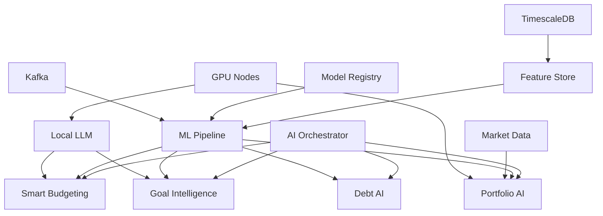

# Wave 2 AI System - Task Delegation Guide for Orchestrator

## Overview

This guide provides the orchestrator with a structured approach to delegating Wave 2 AI implementation tasks to specialized sub-agents. Each task is broken down by expertise area with clear deliverables and dependencies.

## Task Delegation Matrix

### Phase 1: Foundation (Weeks 1-4)

#### 1.1 AI Orchestrator Service

**Primary Agent**: Backend Engineer  
**Supporting Agents**: DevOps Engineer, Security Specialist

```yaml
Tasks:
  Backend_Engineer:
    - Implement FastAPI-based orchestrator service
    - Design request routing logic with pattern matching
    - Implement Redis caching layer with TTL strategies
    - Create circuit breaker patterns for resilience
    - Build A/B testing framework for model variations
    
  DevOps_Engineer:
    - Create Dockerfile with multi-stage build
    - Write Kubernetes manifests (Deployment, Service, HPA)
    - Set up health check endpoints
    - Configure Prometheus metrics collection
    
  Security_Specialist:
    - Implement JWT validation middleware
    - Add request rate limiting
    - Configure CORS policies
    - Set up audit logging for AI requests

Deliverables:
  - Running AI Orchestrator service on port 8084
  - 95% test coverage for routing logic
  - Sub-100ms routing decisions
  - Kubernetes deployment ready
```

#### 1.2 ML Pipeline Infrastructure

**Primary Agent**: ML Engineer  
**Supporting Agents**: Data Engineer, DevOps Engineer

```yaml
Tasks:
  ML_Engineer:
    - Design feature engineering pipeline architecture
    - Implement feature computation DAG with Apache Airflow
    - Create model registry integration with MLflow
    - Build feature validation and monitoring
    
  Data_Engineer:
    - Deploy Kafka cluster with 3 brokers
    - Set up TimescaleDB for feature store
    - Implement data ingestion from PostgreSQL CDC
    - Create data quality checks and monitoring
    
  DevOps_Engineer:
    - Deploy Kafka using Strimzi operator
    - Configure TimescaleDB StatefulSet
    - Set up persistent volume claims
    - Implement backup strategies

Deliverables:
  - Operational Kafka cluster with topics created
  - TimescaleDB feature store with schema
  - MLflow model registry deployed
  - Data pipeline processing 10K events/second
```

#### 1.3 Local LLM Service

**Primary Agent**: ML Engineer  
**Supporting Agents**: Backend Engineer, DevOps Engineer

```yaml
Tasks:
  ML_Engineer:
    - Deploy Llama 3.1 7B model for financial domain
    - Implement fine-tuning pipeline for financial data
    - Create prompt engineering templates
    - Build model quantization for efficiency
    
  Backend_Engineer:
    - Create LLM service API with streaming support
    - Implement token management and context windows
    - Build response caching layer
    - Add fallback mechanisms
    
  DevOps_Engineer:
    - Set up GPU-enabled nodes in Kubernetes
    - Configure model serving with TorchServe
    - Implement model versioning strategy
    - Set up monitoring for GPU utilization

Deliverables:
  - Deployed Llama 3.1 model with financial fine-tuning
  - API endpoint with <2s response time
  - 90% accuracy on financial Q&A benchmarks
  - GPU utilization monitoring dashboard
```

### Phase 2: Smart Features (Weeks 5-8)

#### 2.1 Smart Budgeting AI

**Primary Agent**: ML Engineer  
**Supporting Agents**: Frontend Engineer, Backend Engineer

```yaml
Tasks:
  ML_Engineer:
    - Train transaction categorization model (BERT-based)
    - Implement spending pattern recognition (LSTM)
    - Build anomaly detection system (Isolation Forest)
    - Create budget optimization algorithm (RL)
    
  Frontend_Engineer:
    - Build SmartBudgetDashboard component
    - Implement BudgetInsights visualization
    - Create SpendingPredictor UI
    - Add AnomalyAlert notifications
    
  Backend_Engineer:
    - Create GraphQL resolvers for AI insights
    - Implement real-time streaming endpoints
    - Build feature computation pipeline
    - Add caching for predictions

Deliverables:
  - 95% accuracy transaction categorization
  - Real-time anomaly detection (<5s latency)
  - Interactive budget optimization UI
  - GraphQL API with subscriptions
```

#### 2.2 Goal Achievement Intelligence

**Primary Agent**: ML Engineer  
**Supporting Agents**: Frontend Engineer, Data Scientist

```yaml
Tasks:
  ML_Engineer:
    - Build goal feasibility prediction model
    - Implement milestone optimization algorithm
    - Create behavioral recommendation engine
    - Train success probability calculator
    
  Frontend_Engineer:
    - Create GoalIntelligenceDashboard
    - Build FeasibilityIndicator component
    - Implement MilestoneTimeline visualization
    - Add AlternativePathExplorer
    
  Data_Scientist:
    - Analyze historical goal completion data
    - Create feature engineering for goals
    - Build success factor identification
    - Design A/B testing framework

Deliverables:
  - Goal success prediction with 85% accuracy
  - Dynamic milestone recommendations
  - Personalized motivation strategies
  - Interactive goal planning UI
```

### Phase 3: Advanced Features (Weeks 9-12)

#### 3.1 Investment Portfolio AI

**Primary Agent**: Quantitative Developer  
**Supporting Agents**: ML Engineer, Frontend Engineer

```yaml
Tasks:
  Quantitative_Developer:
    - Implement enhanced Modern Portfolio Theory
    - Build risk assessment models (VaR, CVaR)
    - Create market prediction ensemble
    - Design tax-aware optimization
    
  ML_Engineer:
    - Train market prediction models
    - Build correlation analysis engine
    - Implement reinforcement learning for rebalancing
    - Create backtesting framework
    
  Frontend_Engineer:
    - Build AIPortfolioDashboard
    - Create RiskRadar visualization
    - Implement RebalanceAdvisor UI
    - Add PerformancePredictor charts

Deliverables:
  - Portfolio optimization with Sharpe ratio >1.5
  - Real-time risk monitoring dashboard
  - Automated rebalancing recommendations
  - Market prediction with 70% directional accuracy
```

#### 3.2 Debt Payoff Intelligence

**Primary Agent**: ML Engineer  
**Supporting Agents**: Backend Engineer, Frontend Engineer

```yaml
Tasks:
  ML_Engineer:
    - Build ML-enhanced debt optimization
    - Create interest rate prediction model
    - Implement credit score estimator
    - Design refinancing opportunity detector
    
  Backend_Engineer:
    - Integrate with credit bureau APIs
    - Implement debt calculation engine
    - Create payment scheduling system
    - Build notification service
    
  Frontend_Engineer:
    - Create DebtAIDashboard
    - Build PayoffOptimizer interface
    - Implement CreditScoreEstimator UI
    - Add RefinanceAlert components

Deliverables:
  - Debt optimization saving users 15% on interest
  - Credit score predictions within 20 points
  - Automated refinancing alerts
  - Interactive debt management UI
```

#### 3.3 Market Data Integration

**Primary Agent**: Data Engineer  
**Supporting Agents**: Backend Engineer, DevOps Engineer

```yaml
Tasks:
  Data_Engineer:
    - Integrate Alpha Vantage/Polygon APIs
    - Build real-time data ingestion pipeline
    - Implement data normalization layer
    - Create market data cache with Redis
    
  Backend_Engineer:
    - Build market data service API
    - Implement WebSocket streaming
    - Create data aggregation endpoints
    - Add rate limiting for API calls
    
  DevOps_Engineer:
    - Set up API gateway for providers
    - Configure caching infrastructure
    - Implement failover mechanisms
    - Set up monitoring and alerts

Deliverables:
  - Real-time market data with <1s latency
  - 99.9% data availability
  - Automatic failover between providers
  - Comprehensive market data API
```

### Phase 4: Production Readiness (Weeks 13-16)

#### 4.1 Performance Optimization

**Primary Agent**: Performance Engineer  
**Supporting Agents**: ML Engineer, Backend Engineer

```yaml
Tasks:
  Performance_Engineer:
    - Conduct load testing with k6/Gatling
    - Identify and resolve bottlenecks
    - Optimize database queries
    - Implement caching strategies
    
  ML_Engineer:
    - Quantize models for faster inference
    - Implement batch prediction APIs
    - Optimize feature computation
    - Add model caching layer
    
  Backend_Engineer:
    - Optimize API response times
    - Implement connection pooling
    - Add request queuing
    - Optimize Redis usage

Deliverables:
  - P95 latency <400ms for all endpoints
  - Support for 10K concurrent users
  - 50% reduction in model inference time
  - Comprehensive performance report
```

#### 4.2 Security Hardening

**Primary Agent**: Security Specialist  
**Supporting Agents**: DevOps Engineer, Backend Engineer

```yaml
Tasks:
  Security_Specialist:
    - Conduct security audit
    - Implement differential privacy
    - Add model security measures
    - Create compliance documentation
    
  DevOps_Engineer:
    - Configure network policies
    - Implement RBAC
    - Set up secrets management
    - Configure WAF rules
    
  Backend_Engineer:
    - Add input validation
    - Implement rate limiting
    - Add audit logging
    - Configure CORS policies

Deliverables:
  - Passed security audit
  - GDPR/PCI-DSS compliance
  - Zero high-severity vulnerabilities
  - Complete security documentation
```

#### 4.3 Monitoring & Observability

**Primary Agent**: SRE/DevOps Engineer  
**Supporting Agents**: ML Engineer, Backend Engineer

```yaml
Tasks:
  SRE_Engineer:
    - Set up Prometheus metrics
    - Create Grafana dashboards
    - Implement alerting rules
    - Configure log aggregation
    
  ML_Engineer:
    - Add model drift detection
    - Implement accuracy monitoring
    - Create feature drift alerts
    - Build model performance dashboard
    
  Backend_Engineer:
    - Add custom metrics
    - Implement tracing
    - Add health checks
    - Create SLI/SLO definitions

Deliverables:
  - Complete observability stack
  - ML-specific monitoring dashboards
  - Automated alerting system
  - SRE runbooks and documentation
```

## Dependencies and Coordination

### Critical Path Dependencies



### Inter-Agent Communication

```yaml
Communication_Channels:
  daily_standups:
    - Review progress on assigned tasks
    - Identify blockers and dependencies
    - Coordinate on shared components
    
  weekly_architecture_review:
    - Validate design decisions
    - Ensure consistency across services
    - Review integration points
    
  shared_documentation:
    - API specifications in OpenAPI format
    - Architecture decision records (ADRs)
    - Integration test scenarios
    - Performance benchmarks
```

## Success Criteria

### Phase Completion Metrics

```yaml
Phase_1_Success:
  - All foundation services deployed and operational
  - Integration tests passing with >95% coverage
  - Performance benchmarks meeting targets
  - Documentation complete for all services

Phase_2_Success:
  - Smart features deployed with >90% accuracy
  - User acceptance testing completed
  - A/B tests showing positive impact
  - Frontend components integrated

Phase_3_Success:
  - Advanced AI features operational
  - Market data pipeline stable
  - Investment AI showing positive ROI
  - Debt optimization saving users money

Phase_4_Success:
  - All security audits passed
  - Performance targets achieved
  - Monitoring and alerting operational
  - Production deployment successful
```

## Risk Mitigation Strategies

### Technical Risks

```yaml
Model_Performance_Risk:
  mitigation:
    - Implement A/B testing framework
    - Maintain fallback rule-based systems
    - Progressive rollout with monitoring
    - Regular model retraining schedule

Integration_Complexity:
  mitigation:
    - Define clear API contracts early
    - Implement integration tests first
    - Use feature flags for gradual rollout
    - Maintain backwards compatibility

Scalability_Concerns:
  mitigation:
    - Design for horizontal scaling
    - Implement caching at multiple levels
    - Use async processing where possible
    - Regular load testing and optimization
```

### Coordination Risks

```yaml
Communication_Breakdown:
  mitigation:
    - Daily standups mandatory
    - Shared Slack channels by feature
    - Weekly demos of progress
    - Clear documentation standards

Dependency_Delays:
  mitigation:
    - Identify critical path early
    - Build mock services for testing
    - Parallel development tracks
    - Regular dependency reviews
```

## Conclusion

This task delegation guide provides the orchestrator with a clear roadmap for distributing Wave 2 AI implementation work across specialized sub-agents. Success depends on clear communication, well-defined interfaces, and coordinated execution across all teams.

The modular approach ensures that teams can work independently while maintaining system coherence, and the phased delivery allows for iterative improvements and risk mitigation throughout the implementation process.