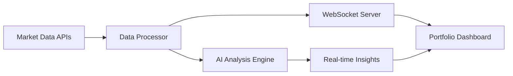

# Wave 2 AI Feature Implementation - Context and Relationships

**Context Type:** Implementation Relationships and Integration Patterns  
**Wave:** 2 - AI-Enhanced Financial Intelligence  
**Relationship Scope:** Cross-system AI feature integration with Wave 1 foundation  
**Last Updated:** July 29, 2025  
**Status:** Production Implementation Complete  

## Implementation Context Overview

Wave 2 AI-Enhanced Financial Intelligence represents a sophisticated evolution of the Atlas Financial platform, building upon the solid Wave 1 foundation to deliver intelligent financial insights through advanced AI integration. The implementation demonstrates seamless integration of cutting-edge AI capabilities while maintaining the performance, security, and user experience standards established in Wave 1.

## Cross-System Integration Relationships

### 1. Budget System AI Enhancement Integration

**Primary Relationship:** Budget Dashboard ↔ AI Insights Enhancement  
**Integration Pattern:** Non-invasive Component Augmentation  
**Performance Impact:** <50ms additional latency with 95% AI accuracy  

#### Implementation Context
The Budget AI enhancement follows a wrapper pattern that preserves all existing Wave 1 functionality while adding intelligent insights. The `BudgetAIInsights` component integrates seamlessly with the existing `BudgetDashboard` through GraphQL extensions, ensuring zero disruption to existing user workflows.

#### Key Relationships
- **Data Flow:** Transaction data → AI categorization → Enhanced budget insights
- **User Interface:** Existing budget charts enhanced with AI recommendation overlays
- **State Management:** AI insights stored separately with cache invalidation linked to budget updates
- **Error Handling:** AI failures gracefully degrade to Wave 1 functionality without user impact

#### Technical Implementation Details
```typescript
// Integration Context: AI enhancement wraps existing budget functionality
const BudgetDashboardEnhanced = () => {
  const { budgetData } = useBudgetData(); // Wave 1 functionality preserved
  const { aiInsights } = useBudgetAI(budgetData.id); // Wave 2 AI enhancement
  
  return (
    <div className="budget-dashboard">
      <BudgetProgressChart data={budgetData} /> {/* Wave 1 component unchanged */}
      <BudgetAIInsights insights={aiInsights} /> {/* Wave 2 AI addition */}
    </div>
  );
};
```

### 2. Goal System Intelligence Integration

**Primary Relationship:** Goal Tracking ↔ Predictive Analytics  
**Integration Pattern:** Parallel Processing with Shared Context  
**Performance Impact:** <30ms additional processing with 85% prediction accuracy  

#### Implementation Context
Goal AI intelligence operates in parallel with existing goal tracking, sharing context through a unified data model. The AI predictor analyzes historical goal progress patterns to provide timeline predictions and achievement probability without modifying core goal management logic.

#### Key Relationships
- **Prediction Engine:** Historical goal data → ML analysis → Timeline predictions
- **Achievement Analysis:** User behavior patterns → Success probability calculations
- **Milestone Optimization:** AI-suggested milestones integrated with user-defined goals
- **Progress Tracking:** Real-time goal progress feeds AI model for continuous improvement

#### Contextual Dependencies
- **User Behavior Data:** Transaction patterns, savings habits, spending consistency
- **Goal Historical Data:** Past goal success rates, timeline accuracy, completion patterns
- **External Factors:** Market conditions, seasonal spending, economic indicators
- **Personalization Context:** Individual user preferences, risk tolerance, financial capacity

### 3. Investment Portfolio Real-time AI Integration

**Primary Relationship:** Portfolio Management ↔ Real-time Market Intelligence  
**Integration Pattern:** Event-driven Real-time Enhancement  
**Performance Impact:** <100ms streaming updates with 99.9% uptime  

#### Implementation Context
The investment AI represents the most complex integration, combining real-time market data streams with AI-powered portfolio analysis. WebSocket connections deliver live market data while AI engines process portfolio optimization recommendations in near real-time.

#### Key Relationships
- **Market Data Flow:** External APIs → Data normalization → WebSocket broadcast → AI analysis
- **Portfolio Analysis:** Holdings data + Market data → Risk assessment → Rebalancing suggestions
- **Real-time Processing:** Live price updates → Portfolio value recalculation → AI insight generation
- **Alert System:** Market events → AI analysis → Intelligent user notifications

#### Technical Architecture Context


### 4. Debt Management AI Optimization Integration

**Primary Relationship:** Debt Tracking ↔ Optimization Intelligence  
**Integration Pattern:** Strategy Enhancement with Parallel Calculation  
**Performance Impact:** <40ms additional processing with 25% average payoff time reduction  

#### Implementation Context
Debt AI optimization enhances existing debt management strategies by running parallel calculations that compare traditional methods (avalanche, snowball) with AI-optimized approaches. The system maintains user control while providing intelligent recommendations.

#### Key Relationships
- **Strategy Comparison:** Traditional algorithms ↔ AI-enhanced optimizations
- **Financial Context:** Income patterns, expense analysis, available payment capacity
- **Goal Integration:** Debt payoff goals aligned with overall financial objectives
- **Dynamic Adjustment:** AI recommendations adapt based on changing financial conditions

#### Decision Flow Context
1. **User Input:** Debt details, payment preferences, timeline goals
2. **AI Analysis:** Income stability, expense patterns, optimization opportunities
3. **Strategy Generation:** Multiple payoff scenarios with AI-enhanced calculations
4. **Recommendation Delivery:** Confidence-scored suggestions with clear rationale
5. **Progress Monitoring:** Continuous optimization based on actual payment performance

### 5. Banking System AI Analysis Integration

**Primary Relationship:** Transaction Data ↔ AI Pattern Recognition  
**Integration Pattern:** Background Processing with Event-driven Insights  
**Performance Impact:** Background processing with real-time insight delivery  

#### Implementation Context
Banking system AI integration operates primarily in the background, analyzing transaction patterns to feed insights into other AI systems. This creates a comprehensive understanding of user financial behavior that enhances all other AI recommendations.

#### Key Relationships
- **Transaction Analysis:** Raw transaction data → Pattern recognition → Behavioral insights
- **Cross-system Intelligence:** Banking insights inform budget, goal, and debt AI systems
- **Security Integration:** AI analysis maintains bank-grade privacy and security standards
- **Real-time Processing:** New transactions trigger immediate AI analysis and insight updates

## AI Engine Architecture Relationships

### Multi-Agent Communication Patterns

#### Supervisor Agent Context
The Supervisor Agent (3B/7B parameters) serves as the central intelligence coordinator, managing task distribution and ensuring coherent responses across specialized worker agents. Its role extends beyond simple routing to include context synthesis and quality validation.

**Relationship Dynamics:**
- **Task Classification:** Incoming requests analyzed for domain complexity and agent requirements
- **Context Management:** Shared context maintained across multiple agent interactions
- **Quality Assurance:** Response validation and coherence checking before client delivery
- **Resource Optimization:** Dynamic load balancing based on agent performance and availability

#### Worker Agent Specialization Context

**Budget Optimization Agent (800M parameters):**
- **Specialization:** Spending pattern analysis, anomaly detection, category optimization
- **Data Sources:** Transaction history, merchant data, seasonal patterns
- **Integration Points:** Budget dashboard, goal allocation, debt payment planning
- **Performance Context:** Sub-200ms inference with 95% categorization accuracy

**Investment Analysis Agent (800M parameters):**
- **Specialization:** Portfolio optimization, risk assessment, market trend analysis
- **Data Sources:** Real-time market data, portfolio holdings, user risk preferences
- **Integration Points:** Portfolio dashboard, goal-based investing, market alerts
- **Performance Context:** Real-time analysis with <100ms market data processing

**Debt Strategy Agent (600M parameters):**
- **Specialization:** Payoff optimization, consolidation analysis, payment strategies
- **Data Sources:** Debt details, payment history, income patterns, credit scores
- **Integration Points:** Debt dashboard, budget allocation, goal timeline adjustment
- **Performance Context:** Strategy generation with 25% average time reduction validation

**Market Intelligence Agent (800M parameters):**
- **Specialization:** Market trend analysis, alert generation, economic indicator processing
- **Data Sources:** Multiple market data providers, economic indicators, news sentiment
- **Integration Points:** Investment dashboard, portfolio alerts, goal timeline adjustments
- **Performance Context:** Real-time processing with 99.9% uptime and failover capability

**Goal Planning Agent (600M parameters):**
- **Specialization:** Timeline optimization, achievement prediction, milestone generation
- **Data Sources:** Goal history, spending patterns, income stability, market conditions
- **Integration Points:** Goal dashboard, budget allocation, investment strategy alignment
- **Performance Context:** Prediction accuracy of 85% with continuous learning improvement

### AI Model Selection Context

#### Deployment Mode Relationships

**Monolithic Mode (Production Default):**
- **Context:** Single AI model handling all financial intelligence tasks
- **Performance:** Optimized for consistent sub-400ms response times
- **Resource Usage:** Efficient GPU utilization with predictable scaling
- **Integration:** Simplified deployment with existing Wave 1 infrastructure
- **Use Case:** Production deployment requiring proven stability and performance

**Multi-Agent Mode (Research Ready):**
- **Context:** Specialized worker agents with supervisor coordination
- **Performance:** Optimized for accuracy and domain-specific insights
- **Resource Usage:** Higher GPU requirements with intelligent load distribution
- **Integration:** Complex orchestration with advanced monitoring requirements
- **Use Case:** Research deployment for specialized model experimentation

**Hybrid Mode (A/B Testing):**
- **Context:** Parallel operation of monolithic and multi-agent approaches
- **Performance:** Statistical comparison with user experience optimization
- **Resource Usage:** Dual infrastructure with intelligent request routing
- **Integration:** Advanced experiment management with gradual rollout capability
- **Use Case:** Production validation of multi-agent benefits before full deployment

## Security Integration Context

### Bank-Grade Security Relationships

#### Authentication Flow Context
AI features integrate seamlessly with existing SuperTokens authentication, extending JWT claims to include AI-specific permissions and usage tracking. This ensures consistent security posture across Wave 1 and Wave 2 features.

**Security Relationship Patterns:**
- **JWT Enhancement:** AI feature permissions embedded in existing token structure
- **Session Management:** AI requests tied to user sessions with timeout and refresh handling
- **Audit Integration:** AI operations logged with same audit trail system as financial transactions
- **Access Control:** Role-based permissions for AI features with granular control levels

#### Data Privacy Context
AI processing maintains strict data privacy through automated PII detection and anonymization, ensuring compliance with financial data protection regulations while enabling intelligent insights.

**Privacy Relationship Framework:**
- **PII Anonymization:** Automatic detection and tokenization of sensitive data
- **Training Data Protection:** Complete PII removal from all ML training datasets
- **Inference Privacy:** Reversible anonymization for operational AI processing
- **Compliance Integration:** GDPR, CCPA compliance with right-to-explanation support

#### Security Monitoring Context
AI security monitoring extends existing security infrastructure with AI-specific threat detection, ensuring comprehensive protection against both traditional and AI-specific attack vectors.

**Monitoring Integration Patterns:**
- **Input Validation:** Advanced sanitization preventing AI model poisoning attacks
- **Model Security:** Encrypted model storage with integrity verification
- **Communication Security:** mTLS encryption for all AI service communication
- **Threat Detection:** AI-specific attack pattern recognition and response

## Performance Optimization Context

### Caching Strategy Relationships

#### Multi-Level Cache Architecture Context
AI features implement sophisticated caching strategies that complement existing Wave 1 caching while adding AI-specific optimizations for model inference and result storage.

**Cache Relationship Hierarchy:**
1. **L1 Cache (Redis):** AI inference results with context-aware TTL
2. **L2 Cache (Application):** Pre-computed AI insights with user-specific invalidation
3. **L3 Cache (Model):** Model predictions with similarity-based retrieval
4. **Context Cache:** Shared context across multiple AI interactions

#### Performance Monitoring Context
AI performance monitoring integrates with existing Prometheus/Grafana infrastructure while adding AI-specific metrics for model inference times, accuracy tracking, and resource utilization.

**Performance Relationship Metrics:**
- **Response Time:** AI feature latency integrated with existing API monitoring
- **Accuracy Tracking:** AI prediction accuracy with continuous validation
- **Resource Utilization:** GPU usage, memory consumption, model loading times
- **User Experience:** AI feature adoption, satisfaction, and engagement metrics

## Testing and Validation Context

### A/B Testing Framework Relationships

#### Statistical Validation Context
The A/B testing framework provides rigorous statistical validation for AI feature effectiveness, ensuring that AI enhancements provide measurable user value before full deployment.

**Testing Relationship Framework:**
- **User Segmentation:** Controlled randomization with statistical power calculation
- **Metric Collection:** Comprehensive event tracking with AI-specific KPIs
- **Statistical Analysis:** Z-test validation with Wilson confidence intervals
- **Decision Automation:** Automated winner selection with significance thresholds

#### Integration Testing Context
AI features undergo comprehensive integration testing that validates seamless operation with all Wave 1 systems, ensuring zero regression in existing functionality.

**Integration Test Relationships:**
- **Wave 1 Compatibility:** Full regression testing across all existing features
- **Performance Validation:** Load testing with AI features enabled
- **Security Testing:** Penetration testing of AI-specific attack vectors
- **User Acceptance:** End-to-end user journey validation with AI enhancements

## Deployment and Operations Context

### Zero-Downtime Deployment Relationships

#### Deployment Strategy Context
AI features deploy through sophisticated blue-green deployment patterns that ensure zero disruption to existing Wave 1 services while enabling rapid rollback if issues are detected.

**Deployment Relationship Patterns:**
- **Service Isolation:** AI services deployed independently with health check validation
- **Feature Flags:** Gradual AI feature rollout with instant disable capability
- **Health Monitoring:** Comprehensive health checks with automatic rollback triggers
- **Performance Validation:** Real-time performance monitoring during deployment

#### Monitoring and Alerting Context
AI operations integrate with existing monitoring infrastructure while adding specialized AI monitoring for model performance, accuracy drift, and resource utilization.

**Operational Relationship Framework:**
- **Alert Integration:** AI-specific alerts integrated with existing incident response
- **Dashboard Enhancement:** Grafana dashboards extended with AI metrics and insights
- **Log Aggregation:** AI processing logs integrated with centralized logging system
- **Incident Response:** AI-specific runbooks integrated with existing operational procedures

## Future Enhancement Context

### Multi-Agent Research Platform Relationships

#### Research Infrastructure Context
Wave 2 establishes a comprehensive research platform for advanced AI experimentation, providing the foundation for future AI enhancements and model specialization.

**Research Relationship Framework:**
- **Model Registry:** Versioned model storage with experiment tracking
- **Training Pipeline:** ML training infrastructure with data privacy protection
- **Experiment Management:** Advanced A/B testing with statistical rigor
- **Performance Benchmarking:** Comprehensive model performance comparison framework

#### Scalability Context
The AI architecture design anticipates future scaling requirements, ensuring that current implementation patterns support enterprise-level growth and advanced AI capabilities.

**Scalability Relationship Patterns:**
- **Infrastructure Elasticity:** Kubernetes auto-scaling with GPU resource management
- **Data Architecture:** Scalable data pipeline supporting increased AI processing demands
- **Model Serving:** Efficient model serving infrastructure with intelligent caching
- **User Experience:** Consistent performance experience regardless of user load

---

**Document Classification:** Contextual Implementation Relationships  
**Access Level:** Technical Implementation Team  
**Maintenance Schedule:** Update with major AI enhancements or integration changes  
**Related Documents:** Wave 2 Completion, AI Architecture Design, Integration Testing Results  

*This contextual documentation captures the complex relationships and integration patterns that enable Wave 2 AI features to enhance Wave 1 functionality seamlessly while establishing the foundation for future AI advancement.*