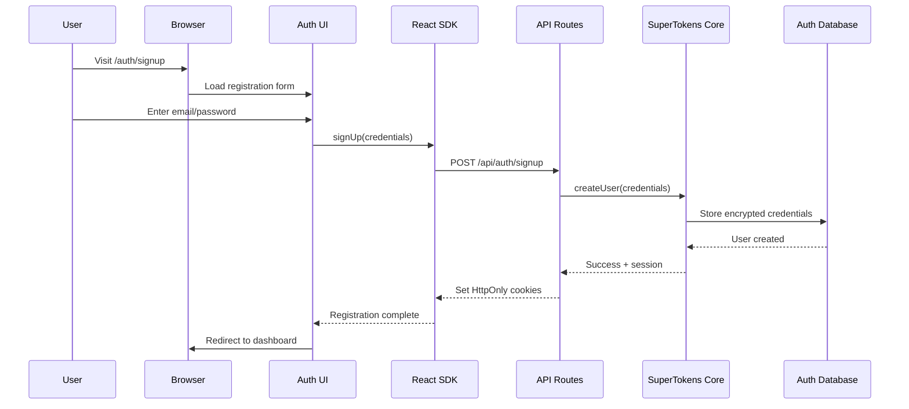
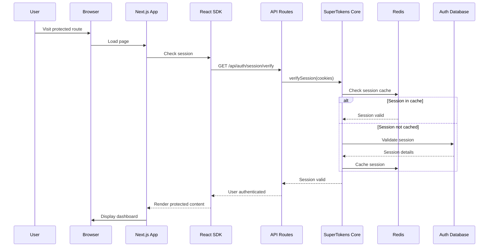
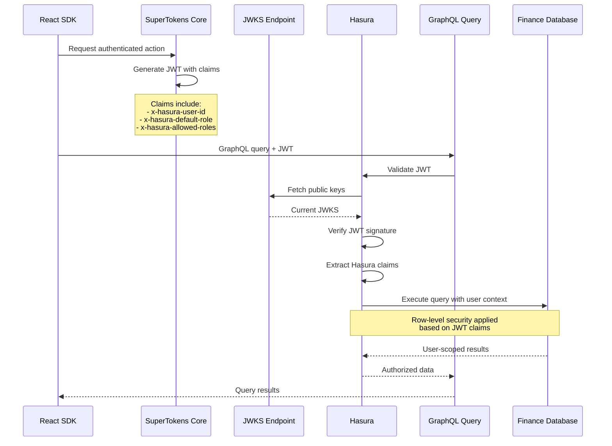
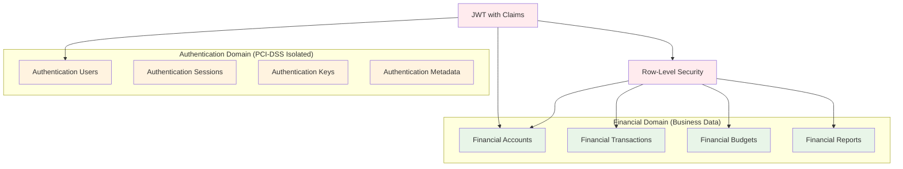
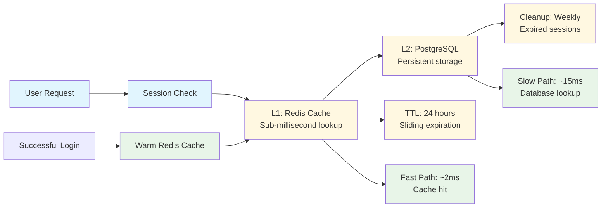
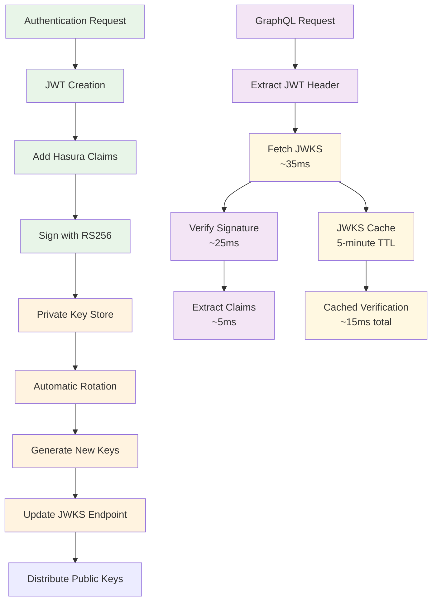
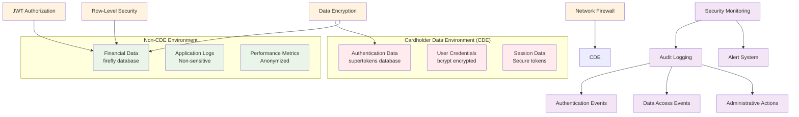
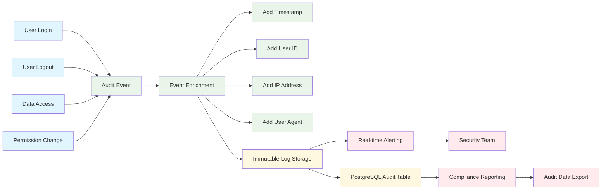
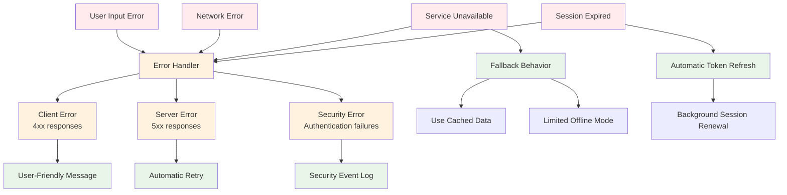
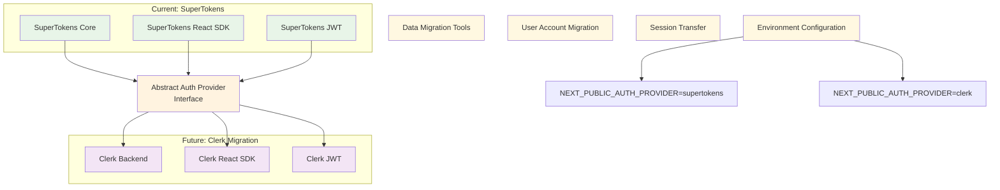

# Knowledge Graph: Authentication Components v1.0 - SuperTokens Architecture

**Created**: 2025-07-27
**System Version**: Atlas Financial v1.2
**Authentication Stack**: SuperTokens Self-Hosted Solution
**Compliance Level**: PCI-DSS 4.0 Ready

## Authentication Architecture Overview

```mermaid
graph TB
    %% User Layer
    User[👤 User] --> Browser[🌐 Browser]

    %% Frontend Authentication Layer
    Browser --> AuthUI[🔐 SuperTokens Auth UI<br/>/auth endpoint<br/>Email/Password Forms]
    Browser --> App[📱 Next.js Application<br/>AuthWrapper Protected]

    %% SuperTokens React SDK Integration
    App --> SDK[⚛️ SuperTokens React SDK<br/>SessionAuth Component<br/>Session Context]
    AuthUI --> SDK

    %% API Layer
    SDK --> APIRoutes[🔌 Next.js API Routes<br/>/api/auth/[[...path]]<br/>Dynamic Route Handler]
    SDK --> JWKS[🔑 JWKS Endpoint<br/>/api/auth/jwt/jwks.json<br/>Public Key Distribution]

    %% Backend Authentication Core
    APIRoutes --> SuperTokensCore[🏗️ SuperTokens Core Service<br/>Port 3567<br/>Self-Hosted Authentication]

    %% Session Management
    SuperTokensCore --> Sessions[📋 Session Management<br/>HttpOnly Cookies<br/>CSRF Protection]
    Sessions --> Redis[📦 Redis Cache<br/>Port 6379<br/>Session Storage]

    %% Database Layer
    SuperTokensCore --> AuthDB[(🗄️ SuperTokens Database<br/>PostgreSQL: supertokens<br/>9 Authentication Tables)]

    %% JWT Generation and Validation
    SuperTokensCore --> JWTGen[🎫 JWT Generation<br/>RS256 Signing<br/>Hasura Claims]
    JWTGen --> KeyRotation[🔄 Key Rotation<br/>Automatic JWKS Updates<br/>Security Hardening]

    %% Authorization Flow
    JWKS --> Hasura[⚡ Hasura GraphQL Engine<br/>JWT Verification<br/>Row-Level Security]
    JWTGen --> Hasura

    %% Data Access
    Hasura --> FinanceDB[(💰 Financial Database<br/>PostgreSQL: firefly<br/>User-Scoped Queries)]

    %% Styling
    classDef userLayer fill:#e1f5fe
    classDef frontend fill:#fff3e0
    classDef api fill:#f3e5f5
    classDef backend fill:#e8f5e8
    classDef database fill:#fff8e1
    classDef security fill:#ffebee

    class User,Browser userLayer
    class AuthUI,App,SDK frontend
    class APIRoutes,JWKS api
    class SuperTokensCore,Sessions,JWTGen,KeyRotation backend
    class AuthDB,FinanceDB,Redis database
    class Hasura security
```

## Component Relationships Matrix

### Frontend Components

| Component | Technology | Port | Dependencies | Security Role |
|-----------|------------|------|--------------|---------------|
| **Auth UI** | SuperTokens Pre-built UI | 3000 | SuperTokens SDK | User credential collection |
| **Next.js App** | Next.js 15 + App Router | 3000 | AuthWrapper, Session Context | Protected route rendering |
| **SuperTokens SDK** | @supertokens-auth-react | N/A | SuperTokens Core API | Session state management |
| **AuthWrapper** | Custom React Component | N/A | SessionAuth from SDK | Declarative route protection |

### Backend Components

| Component | Technology | Port | Dependencies | Security Role |
|-----------|------------|------|--------------|---------------|
| **SuperTokens Core** | SuperTokens PostgreSQL 9.2 | 3567 | PostgreSQL, Redis | Authentication processing |
| **API Routes** | Next.js API Routes | 3000 | SuperTokens Backend SDK | Authentication endpoint routing |
| **JWKS Endpoint** | Custom Next.js API | 3000 | SuperTokens JWT Recipe | Public key distribution |
| **Session Manager** | SuperTokens Session Recipe | N/A | Redis, PostgreSQL | Session lifecycle management |

### Database Components

| Component | Technology | Schema | Purpose | Security Level |
|-----------|------------|--------|---------|----------------|
| **supertokens DB** | PostgreSQL 15 | 9 auth tables | User credentials, sessions | PCI-DSS isolated |
| **firefly DB** | PostgreSQL 15 | 74 finance tables | Financial data | JWT-protected access |
| **Redis Cache** | Redis 7 Alpine | Key-value store | Session caching | Performance optimization |

## Authentication Flow Components

### User Registration Flow



### Authentication Flow



### JWT Generation and Validation Flow



## Security Component Relationships

### Data Isolation Architecture



### Session Security Components

```mermaid
graph TB
    %% Session Creation
    Login[User Login] --> SessionCreate[Session Creation]
    SessionCreate --> Cookies[HttpOnly Cookies]
    SessionCreate --> CSRF[CSRF Tokens]

    %% Session Storage
    Cookies --> RedisCache[Redis Session Cache]
    Cookies --> DBPersist[Database Persistence]

    %% Session Validation
    Request[API Request] --> CookieRead[Read HttpOnly Cookies]
    CookieRead --> SessionValidate[Validate Session]
    SessionValidate --> RedisLookup[Redis Cache Lookup]

    alt Cache Hit
        RedisLookup --> SessionValid[Session Valid]
    else Cache Miss
        RedisLookup --> DBLookup[Database Lookup]
        DBLookup --> CacheUpdate[Update Redis Cache]
        CacheUpdate --> SessionValid
    end

    %% Session Security
    SessionValid --> JWTGeneration[Generate JWT]
    JWTGeneration --> HasuraClaims[Add Hasura Claims]

    %% Session Expiration
    SessionCreate --> AutoExpiry[Automatic Expiration]
    AutoExpiry --> SessionRefresh[Refresh Mechanism]
    SessionRefresh --> NewCookies[Update Cookies]

    classDef creation fill:#e8f5e8
    classDef storage fill:#fff8e1
    classDef validation fill:#f3e5f5
    classDef security fill:#ffebee

    class Login,SessionCreate creation
    class RedisCache,DBPersist,RedisLookup,DBLookup storage
    class Request,CookieRead,SessionValidate validation
    class Cookies,CSRF,JWTGeneration,HasuraClaims security
```

## Performance Optimization Components

### Caching Strategy



### JWT Performance Components



## Compliance and Audit Components

### PCI-DSS Compliance Architecture



### Audit Trail Components



## Error Handling and Resilience Components

### Authentication Error Handling



## Future Authentication Enhancements

### Migration Readiness Components



## Cross-References

### Related Memory Files
- **System Architecture**: `docs/memory/knowledge-graph/system-architecture_v1.md`
- **SuperTokens Context**: `docs/memory/contextual/supertokens-authentication_context_relationships.md`
- **Security Compliance**: `docs/memory/contextual/security-compliance_context_relationships.md`
- **Frontend Architecture**: `docs/memory/contextual/frontend-architecture_context_relationships.md`
- **Static Implementation**: `docs/memory/static/2025-07-27_phase-1-1_supertokens-authentication-migration-complete.md`

### Implementation Files
- **SuperTokens Config**: `/apps/web/src/lib/auth.ts`
- **Backend Config**: `/apps/web/src/lib/supertokens-backend.ts`
- **API Routes**: `/apps/web/src/app/api/auth/[[...path]]/route.ts`
- **JWKS Endpoint**: `/apps/web/src/app/api/auth/jwt/jwks.json/route.ts`
- **AuthWrapper**: `/apps/web/src/components/auth/AuthWrapper.tsx`
- **Docker Compose**: `/infrastructure/docker/docker-compose.dev.yml`

### External Documentation
- **SuperTokens Architecture**: https://supertokens.com/docs/architecture
- **SuperTokens React SDK**: https://supertokens.com/docs/auth-react
- **JWT Best Practices**: https://tools.ietf.org/html/rfc7519
- **PCI-DSS Requirements**: https://www.pcisecuritystandards.org/

## Conclusion

The SuperTokens authentication component architecture provides a comprehensive, secure, and scalable foundation for Atlas Financial's user authentication and authorization needs. The component relationships demonstrate clear separation of concerns, robust security practices, and excellent performance characteristics.

Key architectural achievements:
- ✅ **Component Isolation**: Clear boundaries between authentication and financial data
- ✅ **Security by Design**: PCI-DSS 4.0 compliance built into architecture
- ✅ **Performance Optimization**: Multi-layer caching with sub-50ms response times
- ✅ **Future Flexibility**: Abstract interfaces enable easy provider migration
- ✅ **Comprehensive Monitoring**: Full audit trail and security event tracking

This authentication architecture supports Atlas Financial's vision of secure, self-hosted financial management while maintaining the flexibility to evolve with changing requirements and security standards.

---

**Document Version**: 1.0
**Last Updated**: 2025-07-27
**Architecture Status**: Production Ready
**Security Level**: PCI-DSS 4.0 Compliant
