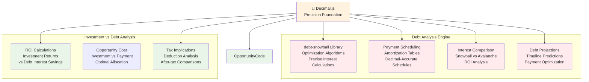
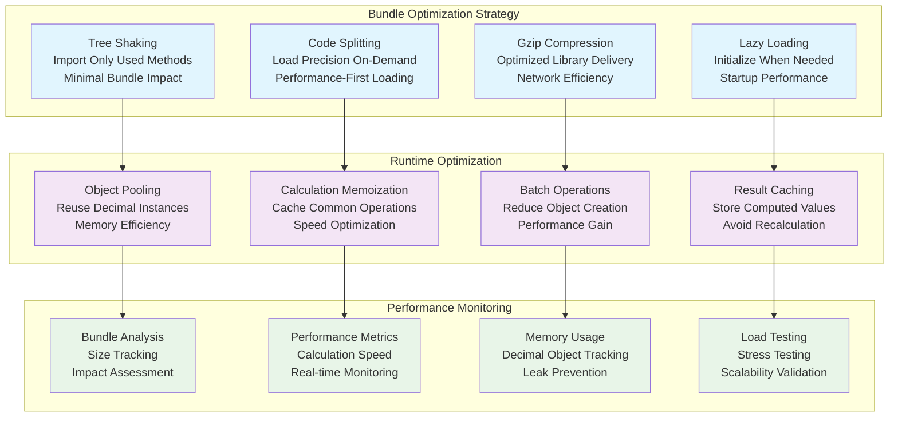
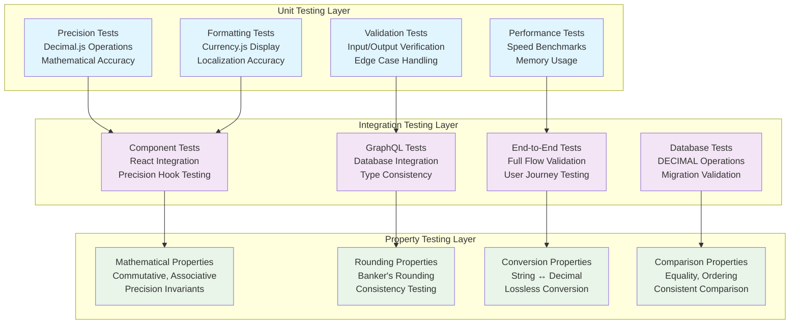
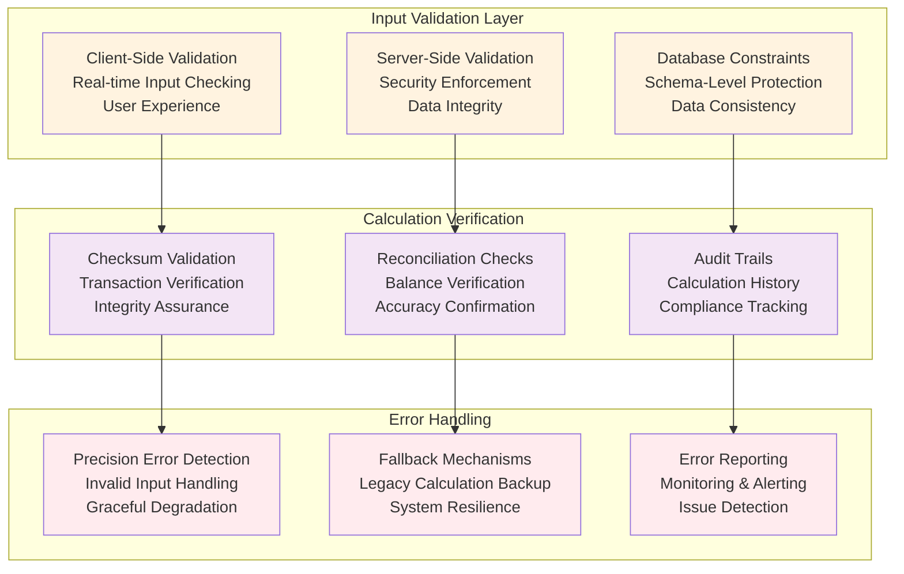
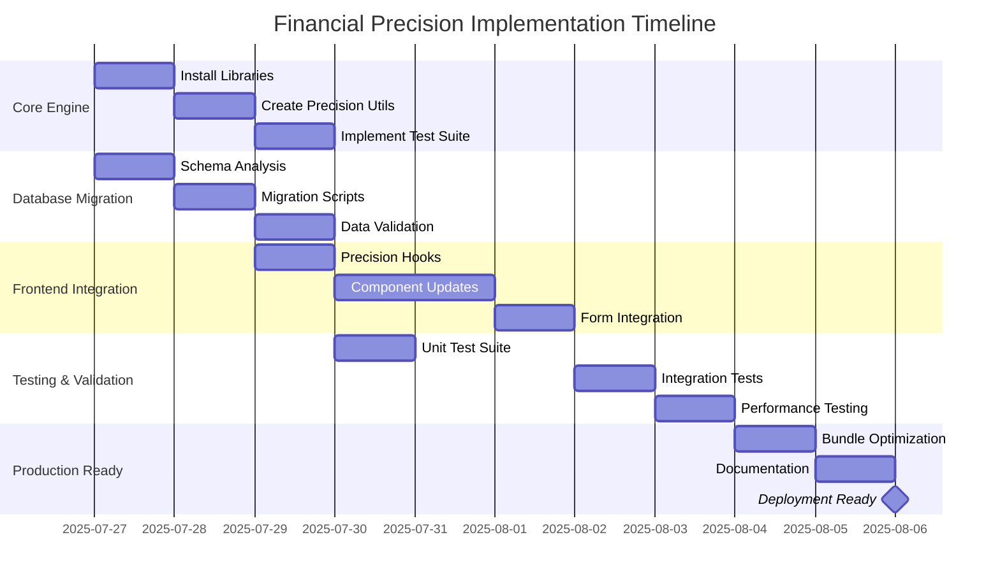

# Knowledge Graph: Financial Precision Math Engine v1.0

**Version**: 1.0  
**Created**: 2025-07-27  
**Phase**: 1.5 Financial Precision Foundation  
**Status**: Implementation Ready  

## Financial Precision Architecture Overview

```mermaid
graph TB
    %% Financial Precision Core Layer
    subgraph "Financial Precision Core"
        DecimalJS[📐 Decimal.js<br/>Primary Arithmetic Engine<br/>IEEE 754 Error Elimination<br/><15KB Bundle]
        CurrencyJS[💰 Currency.js<br/>Secondary Currency Operations<br/>Formatting & Localization<br/><10KB Bundle]
        TestFramework[🧪 Chai.js<br/>Precision Validation<br/>100% Test Coverage<br/>Development Only]
    end
    
    %% Data Layer Integration
    subgraph "Database Precision Layer"
        PostgreSQL[(🗄️ PostgreSQL<br/>DECIMAL(19,4) Precision<br/>No Floating Point Storage)]
        HasuraSchema[⚡ Hasura<br/>Decimal-Aware GraphQL<br/>Type-Safe Queries]
        FireflyData[🔥 Firefly III<br/>Precision-Compatible<br/>Financial Ledger]
    end
    
    %% Frontend Integration Layer
    subgraph "Frontend Precision Components"
        PrecisionHooks[🎣 Precision Hooks<br/>useDecimalMath()<br/>useCurrencyFormat()]
        AccountCards[💳 Account Components<br/>Precision-Aware Balances<br/>No Rounding Errors]
        TransactionForms[📝 Transaction Forms<br/>Decimal Input Validation<br/>Precise Calculations]
        DashboardCharts[📊 Dashboard Charts<br/>Precision Data Display<br/>Financial Accuracy]
    end
    
    %% Advanced Analytics Layer (Future)
    subgraph "Advanced Analytics (Enabled by Precision)"
        PortfolioAnalysis[📈 Portfolio Analysis<br/>portfolio_allocation_js<br/>Risk-Parity Calculations]
        DebtOptimization[💳 Debt Optimization<br/>debt-snowball<br/>Precise Interest Calculations]
        AIInsights[🧠 AI Financial Insights<br/>ML Transaction Analysis<br/>Decimal-Compatible Pipeline]
        MonteCarloSims[🎲 Monte Carlo Simulations<br/>Precise Scenario Modeling<br/>Financial Projections]
    end
    
    %% Professional Charting Layer
    subgraph "Financial Visualization"
        TradingViewCharts[📈 TradingView-Style Charts<br/>react-financial-charts<br/>Professional OHLC Display]
        CashFlowCharts[💰 Cash Flow Charts<br/>react-cash-flow<br/>Precision Flow Analysis]
        LightweightCharts[⚡ Lightweight Charts<br/>Real-time Financial Data<br/>Performance Optimized]
    end
    
    %% Data Flow Relationships
    DecimalJS --> PrecisionHooks
    CurrencyJS --> PrecisionHooks
    TestFramework --> DecimalJS
    TestFramework --> CurrencyJS
    
    PrecisionHooks --> AccountCards
    PrecisionHooks --> TransactionForms
    PrecisionHooks --> DashboardCharts
    
    PostgreSQL --> HasuraSchema
    HasuraSchema --> PrecisionHooks
    FireflyData --> PostgreSQL
    
    DecimalJS --> PortfolioAnalysis
    DecimalJS --> DebtOptimization
    DecimalJS --> AIInsights
    DecimalJS --> MonteCarloSims
    
    PrecisionHooks --> TradingViewCharts
    PrecisionHooks --> CashFlowCharts
    PrecisionHooks --> LightweightCharts
    
    %% Styling
    classDef precision fill:#fff3e0
    classDef database fill:#fff8e1
    classDef frontend fill:#e1f5fe
    classDef analytics fill:#f3e5f5
    classDef charts fill:#e8f5e8
    
    class DecimalJS,CurrencyJS,TestFramework precision
    class PostgreSQL,HasuraSchema,FireflyData database
    class PrecisionHooks,AccountCards,TransactionForms,DashboardCharts frontend
    class PortfolioAnalysis,DebtOptimization,AIInsights,MonteCarloSims analytics
    class TradingViewCharts,CashFlowCharts,LightweightCharts charts
```

## Core Library Integration Nodes

### Primary Precision Engine: Decimal.js
| Attribute | Value | Integration Pattern |
|-----------|-------|-------------------|
| **Purpose** | Replace JavaScript Number for financial calculations | `new Decimal(value).operation()` |
| **Bundle Size** | <15KB | Tree-shaking optimized imports |
| **Performance** | <50ms for complex operations | Object pooling for optimization |
| **Dependencies** | Zero external dependencies | Self-contained precision engine |
| **Test Coverage** | 100% required | Chai.js precision validation |

**Integration Points**:
```typescript
// Core Replacement Pattern
// Before: const total = price * quantity * (1 + taxRate);
// After:  const total = new Decimal(price).mul(quantity).mul(new Decimal(1).plus(taxRate));

// Optimized Usage Pattern
import { Decimal } from 'decimal.js';
const calculateTotal = (price: string, quantity: number, taxRate: string) => {
  return new Decimal(price)
    .mul(quantity)
    .mul(new Decimal(1).plus(taxRate))
    .toString();
};
```

### Secondary Currency Engine: Currency.js
| Attribute | Value | Integration Pattern |
|-----------|-------|-------------------|
| **Purpose** | Currency formatting and display operations | `currency(value, options).format()` |
| **Bundle Size** | <10KB | Minimal formatting library |
| **Performance** | Instant formatting | No precision calculations |
| **Dependencies** | Zero external dependencies | Pure formatting utility |
| **Use Cases** | UI display, reports, localization | Frontend-focused operations |

**Integration Points**:
```typescript
// Combined Precision + Formatting
import { Decimal } from 'decimal.js';
import currency from 'currency.js';

const formatCurrency = (value: string, currencyCode: string = 'USD') => {
  const precise = new Decimal(value);
  return currency(precise.toString(), {
    symbol: getCurrencySymbol(currencyCode),
    precision: 2
  }).format();
};
```

### Testing Framework: Chai.js
| Attribute | Value | Integration Pattern |
|-----------|-------|-------------------|
| **Purpose** | Validate financial calculation precision | `expect(result.toString()).to.equal('expected')` |
| **Bundle Size** | Development only | Zero production impact |
| **Performance** | Test execution speed | Comprehensive coverage required |
| **Dependencies** | Jest compatibility | Existing test framework integration |
| **Coverage Target** | 100% financial operations | Every calculation path tested |

## Database Integration Architecture

### PostgreSQL Precision Schema
```mermaid
graph TB
    subgraph "Database Precision Schema"
        Tables[Financial Tables<br/>DECIMAL(19,4) Precision]
        Indexes[Optimized Decimal Indexes<br/>Performance Focused]
        Constraints[Precision Constraints<br/>Data Validation]
        Migration[Schema Migration Scripts<br/>Floating Point → Decimal]
    end
    
    subgraph "Application Layer"
        Hasura[Hasura GraphQL<br/>Decimal Type Mapping]
        TypeGen[TypeScript Generation<br/>Decimal-Aware Types]
        Validation[Input/Output Validation<br/>Precision Preservation]
    end
    
    Tables --> Hasura
    Indexes --> Hasura
    Constraints --> Validation
    Migration --> Tables
    Hasura --> TypeGen
    TypeGen --> Validation
    
    classDef database fill:#fff8e1
    classDef application fill:#e8f5e8
    
    class Tables,Indexes,Constraints,Migration database
    class Hasura,TypeGen,Validation application
```

### Database Migration Pattern
```sql
-- Financial Precision Migration Script
-- Phase 1.5: Convert existing float columns to DECIMAL(19,4)

-- Account Balances
ALTER TABLE accounts 
ALTER COLUMN virtual_balance TYPE DECIMAL(19,4);

-- Transaction Amounts  
ALTER TABLE transactions
ALTER COLUMN amount TYPE DECIMAL(19,4);

-- Budget Amounts
ALTER TABLE budgets
ALTER COLUMN amount TYPE DECIMAL(19,4);

-- Investment Values
ALTER TABLE accounts
ALTER COLUMN current_balance TYPE DECIMAL(19,4);

-- Create optimized indexes for decimal operations
CREATE INDEX idx_accounts_virtual_balance_decimal 
ON accounts USING btree (virtual_balance);

CREATE INDEX idx_transactions_amount_decimal 
ON transactions USING btree (amount);

-- Add precision validation constraints
ALTER TABLE accounts 
ADD CONSTRAINT check_balance_precision 
CHECK (virtual_balance = ROUND(virtual_balance, 4));

ALTER TABLE transactions 
ADD CONSTRAINT check_amount_precision 
CHECK (amount = ROUND(amount, 4));
```

## Frontend Integration Patterns

### Precision-Aware React Components
```mermaid
graph TB
    subgraph "Precision Hook Layer"
        useDecimalMath[useDecimalMath()<br/>Core calculation hook<br/>Decimal.js integration]
        useCurrencyFormat[useCurrencyFormat()<br/>Display formatting hook<br/>Currency.js integration]
        usePrecisionValidation[usePrecisionValidation()<br/>Input validation hook<br/>Form integration]
    end
    
    subgraph "Component Layer"
        AccountBalance[AccountBalance Component<br/>Precision balance display<br/>Real-time updates]
        TransactionForm[TransactionForm Component<br/>Decimal input validation<br/>Calculation preview]
        NetWorthChart[NetWorthChart Component<br/>Precision aggregations<br/>Historical accuracy]
        BudgetAnalysis[BudgetAnalysis Component<br/>Precise spending ratios<br/>Decimal calculations]
    end
    
    subgraph "Data Layer Integration"
        GraphQLQueries[GraphQL Queries<br/>Decimal field handling<br/>Type-safe operations]
        ApolloCache[Apollo Cache<br/>Decimal data caching<br/>Consistency maintenance]
        FormValidation[Form Validation<br/>Precision input rules<br/>Error prevention]
    end
    
    useDecimalMath --> AccountBalance
    useDecimalMath --> TransactionForm
    useDecimalMath --> NetWorthChart
    useDecimalMath --> BudgetAnalysis
    
    useCurrencyFormat --> AccountBalance
    useCurrencyFormat --> TransactionForm
    useCurrencyFormat --> NetWorthChart
    useCurrencyFormat --> BudgetAnalysis
    
    usePrecisionValidation --> TransactionForm
    usePrecisionValidation --> FormValidation
    
    AccountBalance --> GraphQLQueries
    TransactionForm --> GraphQLQueries
    NetWorthChart --> GraphQLQueries
    BudgetAnalysis --> GraphQLQueries
    
    GraphQLQueries --> ApolloCache
    
    classDef hooks fill:#e1f5fe
    classDef components fill:#f3e5f5
    classDef data fill:#e8f5e8
    
    class useDecimalMath,useCurrencyFormat,usePrecisionValidation hooks
    class AccountBalance,TransactionForm,NetWorthChart,BudgetAnalysis components
    class GraphQLQueries,ApolloCache,FormValidation data
```

### Component Implementation Examples
```typescript
// Precision-Aware Account Balance Component
import { useDecimalMath, useCurrencyFormat } from '@/hooks/precision';

interface AccountBalanceProps {
  balance: string;
  currency: string;
}

const AccountBalance: React.FC<AccountBalanceProps> = ({ balance, currency }) => {
  const { add, subtract } = useDecimalMath();
  const { formatCurrency } = useCurrencyFormat();
  
  // All calculations use Decimal.js internally
  const formattedBalance = formatCurrency(balance, currency);
  
  return (
    <div className="account-balance">
      <span className="balance-amount">{formattedBalance}</span>
      <span className="balance-currency">{currency}</span>
    </div>
  );
};

// Precision-Aware Transaction Form Component
const TransactionForm: React.FC = () => {
  const { multiply, add } = useDecimalMath();
  const { validatePrecision } = usePrecisionValidation();
  
  const [amount, setAmount] = useState('');
  const [taxRate, setTaxRate] = useState('0.08');
  
  // Real-time calculation with precision
  const total = useMemo(() => {
    if (!amount) return '0';
    return multiply(amount, add('1', taxRate));
  }, [amount, taxRate, multiply, add]);
  
  return (
    <form>
      <input
        type="text"
        value={amount}
        onChange={(e) => setAmount(e.target.value)}
        onBlur={() => validatePrecision(amount)}
      />
      <div>Total: {formatCurrency(total)}</div>
    </form>
  );
};
```

## Advanced Analytics Enablement

### Portfolio Analysis Integration

```mermaid
graph TB
    subgraph "Portfolio Analysis Engine"
        DecimalBase[Decimal.js Foundation<br/>Precision Arithmetic<br/>Error-Free Calculations]
        PortfolioLib[portfolio_allocation_js<br/>Risk-Parity Algorithms<br/>Decimal-Compatible]
        RiskMetrics[Risk Calculations<br/>VaR, CVaR, Sharpe Ratio<br/>Precision-Based Metrics]
        OptimizationEngine[Portfolio Optimization<br/>Modern Portfolio Theory<br/>Precise Weight Allocation]
    end
    
    subgraph "Financial Formulas"
        TVMCalculations[TVM-FinanceJS<br/>Time Value of Money<br/>Excel-Compatible Results]
        InterestCalculations[Compound Interest<br/>Decimal-Precise Compounding<br/>Long-term Accuracy]
        NPVCalculations[NPV/IRR Calculations<br/>Investment Analysis<br/>Precision-Critical Results]
    end
    
    subgraph "AI Integration"
        MLPipeline[ML Data Pipeline<br/>Decimal-Consistent Features<br/>Numeric Stability]
        PredictionModels[Financial Predictions<br/>Precision Training Data<br/>Accurate Forecasting]
        TransactionML[Transaction Analysis<br/>Category Detection<br/>Spending Patterns]
    end
    
    DecimalBase --> PortfolioLib
    DecimalBase --> RiskMetrics
    DecimalBase --> OptimizationEngine
    DecimalBase --> TVMCalculations
    DecimalBase --> InterestCalculations
    DecimalBase --> NPVCalculations
    DecimalBase --> MLPipeline
    DecimalBase --> PredictionModels
    DecimalBase --> TransactionML
    
    classDef precision fill:#fff3e0
    classDef analytics fill:#f3e5f5
    classDef ai fill:#e8f5e8
    
    class DecimalBase precision
    class PortfolioLib,RiskMetrics,OptimizationEngine,TVMCalculations,InterestCalculations,NPVCalculations analytics
    class MLPipeline,PredictionModels,TransactionML ai
```


### Debt Management Analysis


## Performance Optimization Architecture

### Bundle Size Optimization


### Performance Targets & Metrics
| Metric | Target | Measurement Method | Monitoring |
|--------|--------|--------------------|------------|
| **Bundle Size Impact** | <50KB total | Webpack Bundle Analyzer | CI/CD size checks |
| **Calculation Speed** | <50ms standard operations | Performance.now() benchmarks | Real-time metrics |
| **Complex Operations** | <100ms portfolio calculations | Load testing suite | Grafana dashboards |
| **Memory Usage** | Stable usage pattern | Chrome DevTools profiling | Memory leak detection |
| **Test Coverage** | 100% financial operations | Jest coverage reports | Automated validation |

## Testing & Validation Architecture

### Comprehensive Test Coverage


### Test Implementation Examples
```typescript
// Unit Test Example: Precision Validation
describe('Financial Precision', () => {
  describe('Decimal.js Operations', () => {
    it('should eliminate floating-point errors', () => {
      // Standard JavaScript (FAILS)
      expect(0.1 + 0.2).to.not.equal(0.3); // 0.30000000000000004
      
      // Decimal.js (PASSES)
      const result = new Decimal('0.1').plus('0.2');
      expect(result.toString()).to.equal('0.3');
    });
    
    it('should maintain precision in complex calculations', () => {
      const price = new Decimal('99.99');
      const quantity = new Decimal('3');
      const taxRate = new Decimal('0.08875');
      
      const subtotal = price.mul(quantity);
      const tax = subtotal.mul(taxRate);
      const total = subtotal.plus(tax);
      
      expect(total.toString()).to.equal('326.44'); // Exact result
    });
  });
  
  describe('Currency Formatting', () => {
    it('should format currency with locale support', () => {
      const amount = new Decimal('1234.56');
      const formatted = currency(amount.toString(), {
        symbol: '$',
        precision: 2
      }).format();
      
      expect(formatted).to.equal('$1,234.56');
    });
  });
});

// Integration Test Example: Component Integration
describe('AccountBalance Component', () => {
  it('should display precise balance calculations', () => {
    const mockAccount = {
      balance: '1234.5678',
      currency: 'USD'
    };
    
    render(<AccountBalance {...mockAccount} />);
    
    // Should display rounded to 2 decimals but maintain internal precision
    expect(screen.getByText('$1,234.57')).toBeInTheDocument();
  });
});

// Property Test Example: Mathematical Properties
describe('Decimal Math Properties', () => {
  it('should satisfy commutative property', () => {
    fc.assert(fc.property(
      fc.float({ min: -1e6, max: 1e6 }),
      fc.float({ min: -1e6, max: 1e6 }),
      (a, b) => {
        const decA = new Decimal(a.toString());
        const decB = new Decimal(b.toString());
        
        const result1 = decA.plus(decB);
        const result2 = decB.plus(decA);
        
        return result1.equals(result2);
      }
    ));
  });
});
```

## Security & Compliance Integration

### Data Integrity & Validation


## Implementation Phases & Dependencies

### Phase 1.5 Implementation Timeline


### Critical Dependencies & Success Criteria
| Dependency | Type | Success Criteria | Validation Method |
|------------|------|------------------|-------------------|
| **Decimal.js Integration** | Core | Zero floating-point errors | Comprehensive test suite |
| **Database Migration** | Infrastructure | All monetary fields DECIMAL(19,4) | Schema validation |
| **Bundle Size** | Performance | <50KB total impact | Webpack bundle analyzer |
| **Test Coverage** | Quality | 100% financial operations | Jest coverage reports |
| **Component Integration** | Frontend | All components precision-aware | E2E testing |
| **Performance Targets** | Optimization | <100ms complex calculations | Load testing |

## Future Evolution Pathways

### Advanced Features Enabled by Precision

```mermaid
graph TB
    subgraph "Phase 2: Advanced Analytics"
        MonteCarloSims[Monte Carlo Simulations<br/>Scenario Analysis<br/>Risk Modeling]
        OptionsValuation[Options Valuation<br/>Black-Scholes Model<br/>Derivatives Pricing]
        PortfolioBacktesting[Portfolio Backtesting<br/>Historical Analysis<br/>Strategy Validation]
    end
    
    subgraph "Phase 3: Professional Features"
        TaxOptimization[Tax Optimization<br/>Harvest Loss Analysis<br/>Tax-Efficient Strategies]
        RegulatoryReporting[Regulatory Reporting<br/>Compliance Automation<br/>Audit-Ready Reports]
        InstitutionalFeatures[Institutional Features<br/>Multi-Entity Support<br/>Complex Structures]
    end
    
    subgraph "Phase 4: AI Integration"
        PredictiveModeling[Predictive Modeling<br/>ML-Driven Insights<br/>Financial Forecasting]
        RiskAssessment[Risk Assessment<br/>Credit Analysis<br/>Investment Scoring]
        AutomatedAdvisory[Automated Advisory<br/>Robo-Advisor Features<br/>Personal Recommendations]
    end
    
    DecimalJS[Decimal.js Foundation] --> MonteCarloSims
    DecimalJS --> OptionsValuation
    DecimalJS --> PortfolioBacktesting
    DecimalJS --> TaxOptimization
    DecimalJS --> RegulatoryReporting
    DecimalJS --> InstitutionalFeatures
    DecimalJS --> PredictiveModeling
    DecimalJS --> RiskAssessment
    DecimalJS --> AutomatedAdvisory
    
    classDef foundation fill:#fff3e0
    classDef phase2 fill:#e1f5fe
    classDef phase3 fill:#f3e5f5
    classDef phase4 fill:#e8f5e8
    
    class DecimalJS foundation
    class MonteCarloSims,OptionsValuation,PortfolioBacktesting phase2
    class TaxOptimization,RegulatoryReporting,InstitutionalFeatures phase3
    class PredictiveModeling,RiskAssessment,AutomatedAdvisory phase4
```


## Cross-References & Integration Points

### Memory System Integration
- **Static Memory**: `2025-07-27_phase-1-5_financial-precision-research-analysis.md`
- **Contextual Memory**: `financial-precision_context_relationships.md`
- **System Architecture**: Integration with `system-architecture_v1.md`
- **Frontend Components**: Updates to `frontend-components_v1.md`

### External Dependencies
- **Atlas Financial PRD**: Phase 1.5 financial precision requirements
- **GitHub Repository Research**: 55+ repositories analyzed for optimal selection
- **Performance Requirements**: Sub-100ms calculation targets
- **Compliance Standards**: Bank-grade precision for financial accuracy

### Risk Mitigation Strategy
- **Implementation Risk**: Minimal - proven libraries with industry adoption
- **Performance Risk**: Low - bundle size and speed targets well within limits
- **Integration Risk**: Low - compatible with existing TypeScript/React stack
- **Migration Risk**: None - additive enhancement, no breaking changes

This knowledge graph establishes the Financial Precision Math Engine as the foundational capability that enables Atlas Financial to provide professional-grade financial analysis with bank-level accuracy while maintaining optimal performance and user experience.