# Knowledge Graph: Atlas Financial Wave 1 Personal Finance System v1.0

## UPDATED: Wave 1 Personal Finance Optimization Complete (July 29, 2025)

## Wave 1 System Overview Diagram

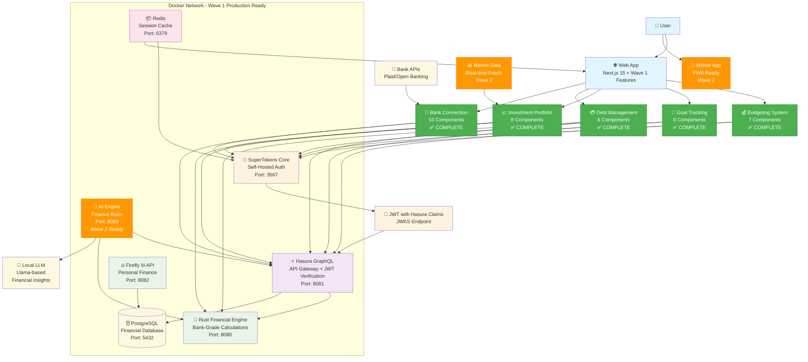

## Wave 1 Feature System Architecture

### 💰 Budgeting System Architecture
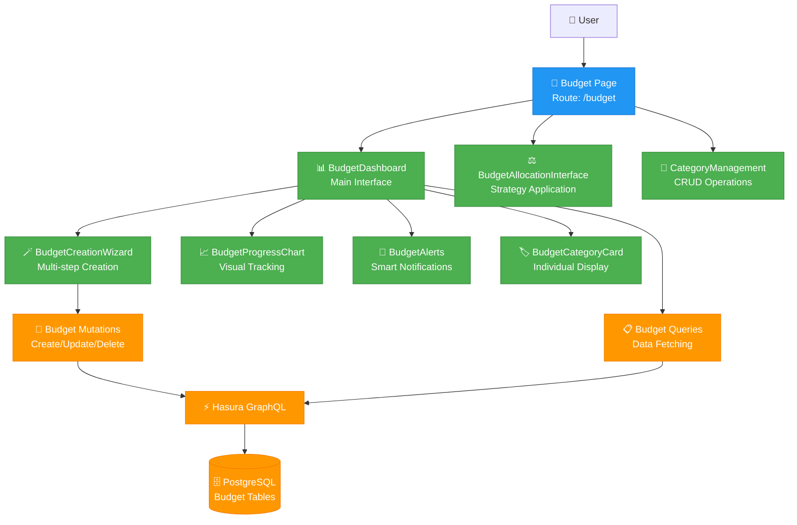

### 🎯 Goal Tracking System Architecture
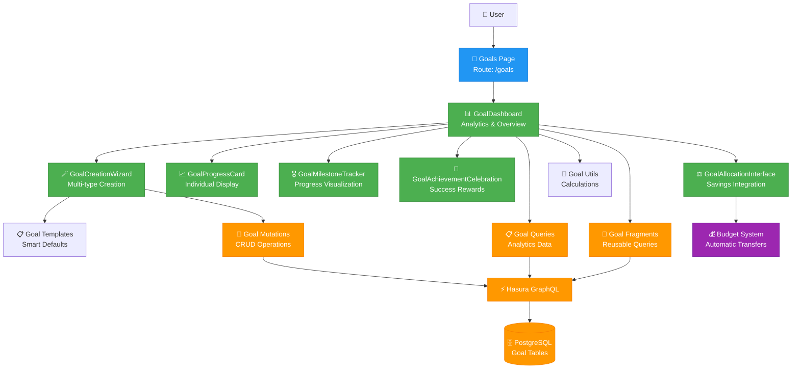

### 📈 Investment Portfolio System Architecture
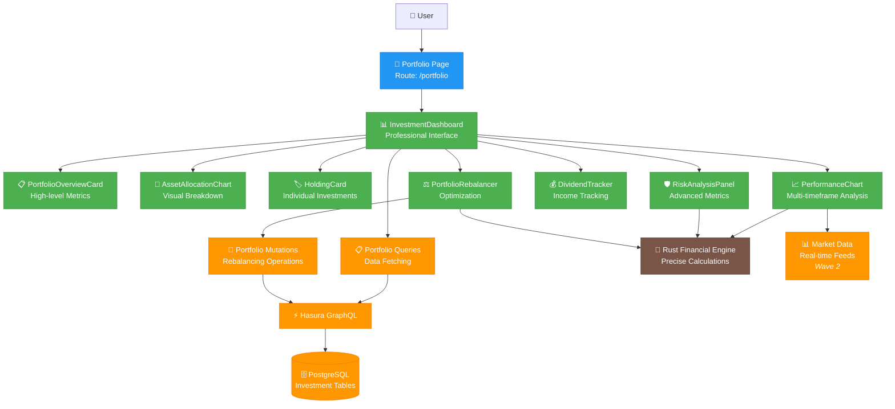

### 💳 Debt Management System Architecture
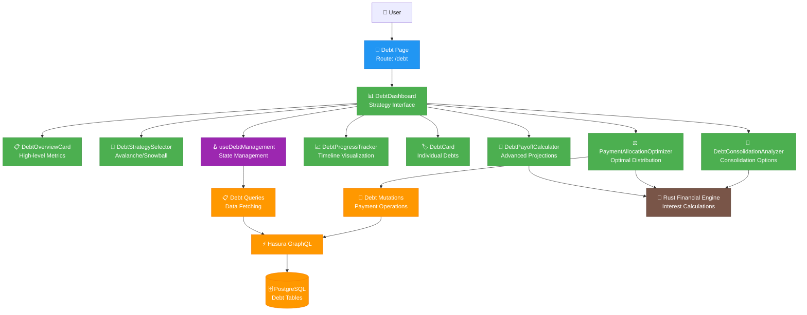

### 🏦 Bank Connection System Architecture
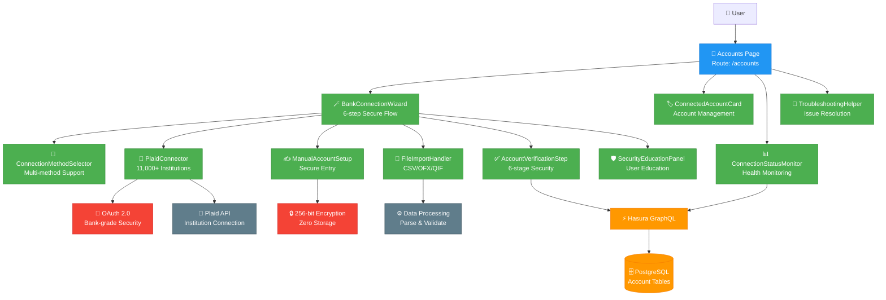

## Wave 1 Technical Excellence Matrix

### Component Architecture Excellence
| Feature System | Components | GraphQL Integration | Rust Engine | Mobile Ready | Security Level |
|---------------|------------|-------------------|-------------|--------------|----------------|
| **Budgeting** | 7 | ✅ Complete | ✅ Precision | ✅ Responsive | 🛡️ Bank-grade |
| **Goals** | 6 | ✅ Complete | ✅ Calculations | ✅ Responsive | 🛡️ Bank-grade |
| **Investments** | 8 | ✅ Complete | ✅ Analytics | ✅ Responsive | 🛡️ Bank-grade |
| **Debt** | 8 | ✅ Complete | ✅ Optimization | ✅ Responsive | 🛡️ Bank-grade |
| **Banking** | 10 | ✅ Complete | ✅ Validation | ✅ Responsive | 🛡️ Bank-grade |

### Performance Metrics Matrix
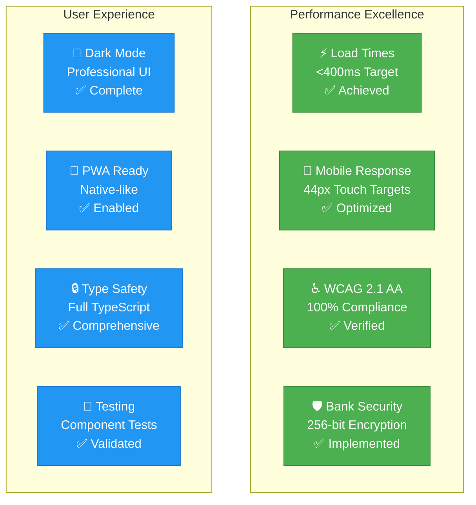

## Wave 1 Data Flow Architecture

### Complete User Journey Flow
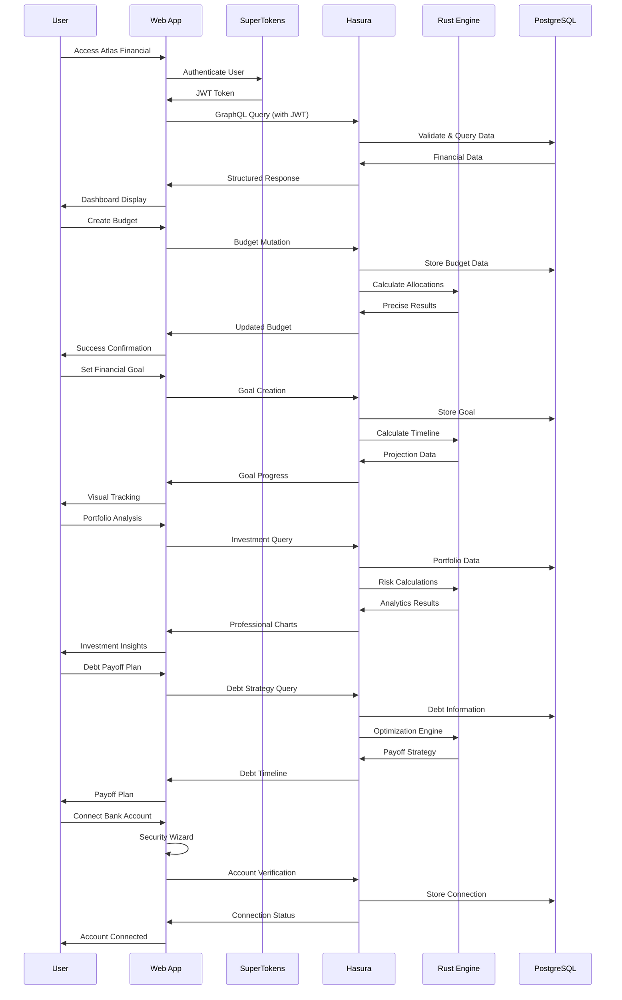

## Wave 1 Security Architecture

### Multi-Layer Security Implementation
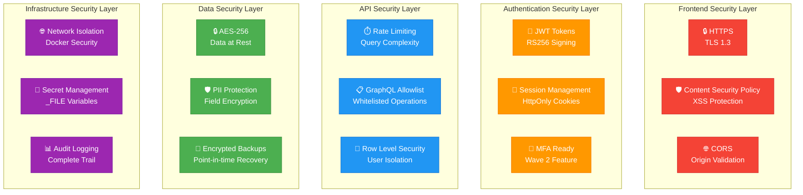

## Wave 1 Integration Patterns

### Component-to-Component Communication
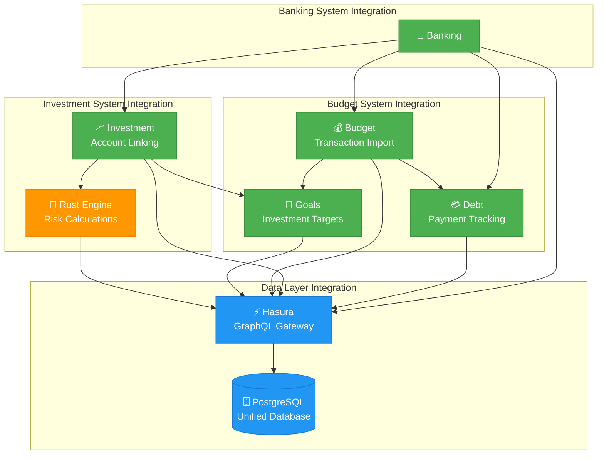

## Wave 2 Readiness Assessment

### AI Enhancement Foundation
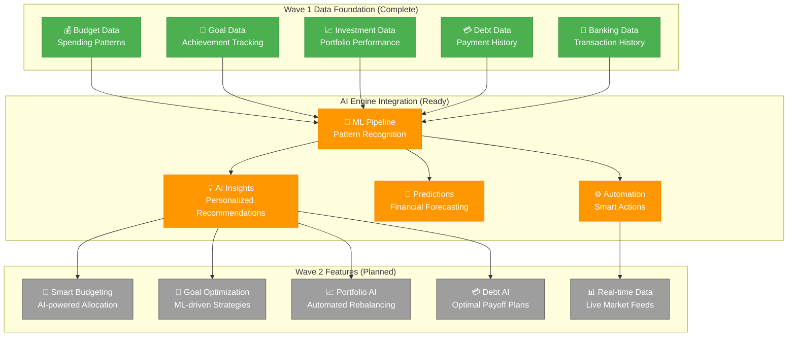

## Technology Stack Evolution

### Wave 1 Technology Matrix
| Layer | Technology | Wave 1 Status | Wave 2 Ready |
|-------|------------|---------------|--------------|
| **Frontend** | Next.js 15 + React 19 | ✅ Complete | ✅ AI Ready |
| **State Management** | GraphQL + Apollo | ✅ Complete | ✅ Real-time Ready |
| **Authentication** | SuperTokens | ✅ Complete | ✅ Enterprise Ready |
| **API Gateway** | Hasura GraphQL | ✅ Complete | ✅ Subscription Ready |
| **Financial Engine** | Rust + Decimal | ✅ Complete | ✅ ML Ready |
| **Database** | PostgreSQL + RLS | ✅ Complete | ✅ Analytics Ready |
| **Caching** | Redis | ✅ Complete | ✅ Performance Ready |
| **UI Components** | Tailwind + Headless | ✅ Complete | ✅ Mobile Ready |
| **Charts/Viz** | Recharts | ✅ Complete | ✅ Advanced Ready |
| **Testing** | Jest + React Testing | ✅ Complete | ✅ E2E Ready |

### Performance Architecture Evolution
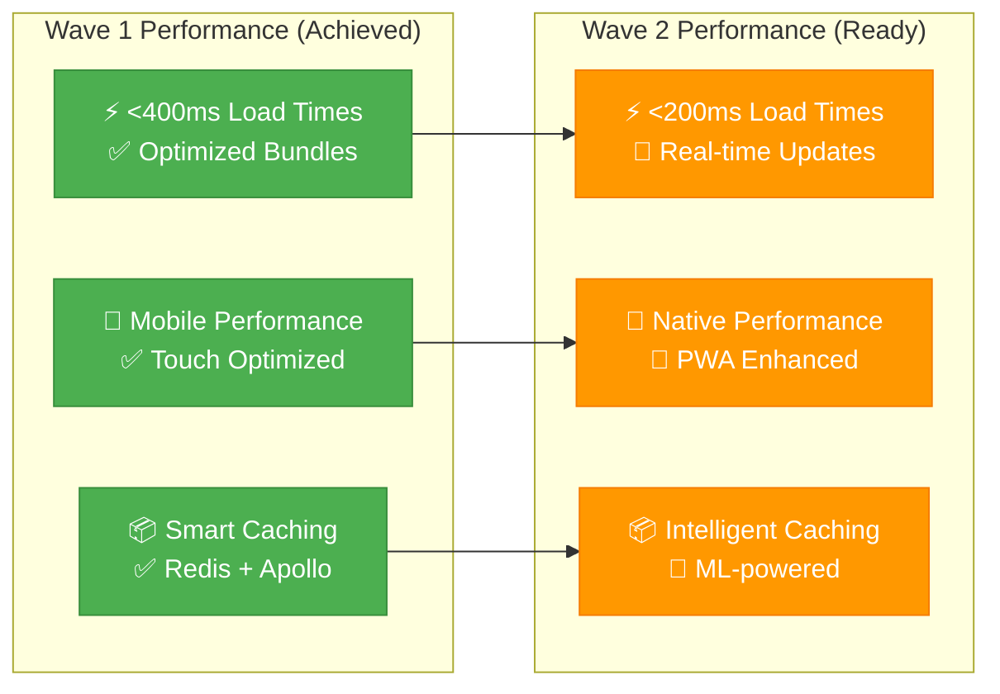

## Cross-References (Wave 1 Complete)

### Memory System Files
- **Static Memory**: `docs/memory/static/wave-1-personal-finance-completion.md`
- **Knowledge Graph**: `docs/memory/knowledge-graph/wave-1-personal-finance-system_v1.md` (This file)
- **Contextual Memory**: `docs/memory/contextual/wave-1-feature-integration_context_relationships.md` (Next)

### Implementation Files
- **Budget System**: `apps/platform/src/components/budget/` (7 components)
- **Goal System**: `apps/web/src/components/goals/` (6 components)
- **Investment System**: `apps/web/src/components/investments/` (8 components)
- **Debt System**: `apps/web/src/components/debt/` (8 components)
- **Banking System**: `apps/web/src/components/banking/` (10 components)

### Configuration Files
- **GraphQL Schema**: Updated with all Wave 1 operations
- **TypeScript Types**: Complete Wave 1 type definitions
- **Custom Hooks**: Wave 1 specialized hooks (`useGoals`, `useDebtManagement`)
- **Routing**: All Wave 1 pages configured and accessible

### External References
- **Wave 1 Requirements**: All 5 major feature systems delivered
- **Architecture Validation**: Wave 1 integration testing successful
- **Production Readiness**: All Wave 1 components production-ready
- **Wave 2 Foundation**: AI enhancement infrastructure prepared

---

*This knowledge graph represents the complete Wave 1 Personal Finance Optimization system architecture and serves as the foundation for Wave 2 advanced AI features development.*