# Wave 2 AI-Enhanced Financial Intelligence System - Knowledge Graph v1

**System Version:** Atlas Financial v1.1 Wave 2  
**Architecture Type:** AI-Enhanced Personal Finance with Multi-Agent Support  
**Last Updated:** July 29, 2025  
**Status:** Production Ready ✅  

## System Architecture Overview

## AI Architecture Decision Tree

## Real-time Market Data Flow

## AI Feature Integration Patterns

## Multi-Agent Communication Protocol

```mermaid
graph TD
    %% Request Flow
    UserRequest[User Request] --> Supervisor[Supervisor Agent]
    
    %% Task Analysis
    Supervisor --> TaskAnalysis{Task Analysis}
    TaskAnalysis --> Domain{Domain Classification}
    
    %% Single Domain Tasks
    Domain -->|Budget Only| BudgetAgent[Budget Agent]
    Domain -->|Investment Only| InvestAgent[Investment Agent]
    Domain -->|Debt Only| DebtAgent[Debt Agent]
    Domain -->|Market Only| MarketAgent[Market Agent]
    Domain -->|Goal Only| GoalAgent[Goal Agent]
    
    %% Multi-Domain Tasks
    Domain -->|Multi-Domain| Coordination[Multi-Agent Coordination]
    
    %% Coordination Flow
    Coordination --> ParallelExecution[Parallel Agent Execution]
    ParallelExecution --> BudgetAgent
    ParallelExecution --> InvestAgent
    ParallelExecution --> DebtAgent
    ParallelExecution --> MarketAgent
    ParallelExecution --> GoalAgent
    
    %% Response Aggregation
    BudgetAgent --> ResponseAgg[Response Aggregation]
    InvestAgent --> ResponseAgg
    DebtAgent --> ResponseAgg
    MarketAgent --> ResponseAgg
    GoalAgent --> ResponseAgg
    
    %% Final Processing
    ResponseAgg --> ContextSynthesis[Context Synthesis]
    ContextSynthesis --> QualityValidation[Quality Validation]
    QualityValidation --> FinalResponse[Final Response]
    
    %% Caching
    FinalResponse --> CacheUpdate[Update Response Cache]
    CacheUpdate --> UserResponse[User Response <400ms]
    
    style Supervisor fill:#fff3e0
    style Coordination fill:#f3e5f5
    style ResponseAgg fill:#e8f5e8
    style QualityValidation fill:#ffebee
```

## Security Architecture

## Performance Architecture

## A/B Testing Framework Architecture

## Monitoring and Observability

## Deployment Pipeline Architecture

## Data Flow and Dependencies

## Component Dependencies Matrix

| Component | Dependencies | Provides | SLA |
|-----------|-------------|----------|-----|
| AI Engine | Redis, PostgreSQL, GPU Resources | AI Insights, Predictions | <400ms, 99.9% |
| Market Data Service | Alpha Vantage, IEX Cloud, Redis | Real-time Market Data | <100ms, 99.9% |
| WebSocket Server | Market Data Service, Auth Service | Real-time Connections | <50ms, 99.95% |
| A/B Testing Service | PostgreSQL, Feature Flags | Experiment Management | <200ms, 99.5% |
| Security Layer | Certificate Authority, Audit Store | Security Validation | <50ms, 99.99% |
| Monitoring Stack | All Services | Observability | <5s, 99.5% |

## Integration Points with Wave 1

| Wave 1 System | Wave 2 Enhancement | Integration Method | Performance Impact |
|---------------|-------------------|-------------------|-------------------|
| Budget Dashboard | Budget AI Insights | GraphQL Extension | <50ms additional |
| Goal Dashboard | Goal AI Predictor | React Component Wrapper | <30ms additional |
| Portfolio Overview | Real-time AI Analysis | WebSocket Subscription | <100ms streaming |
| Debt Dashboard | Debt AI Optimization | GraphQL Mutation Enhancement | <40ms additional |
| Banking System | Transaction AI Analysis | Event-driven Processing | Background processing |

## Scalability Characteristics

| Metric | Current Capacity | Tested Limit | Auto-scaling Trigger |
|--------|------------------|--------------|---------------------|
| Concurrent Users | 10,000+ | 15,000 | CPU > 70% |
| AI Requests/sec | 1,000 | 1,500 | Queue depth > 100 |
| WebSocket Connections | 10,000 | 12,000 | Memory > 80% |
| Market Data Updates/sec | 100 | 150 | Connection pool > 80% |
| A/B Test Events/sec | 5,000 | 7,500 | Database connections > 70% |

## Future Enhancement Readiness

### Multi-Agent Deployment Readiness
- **Infrastructure:** Kubernetes cluster with GPU scheduling ✅
- **Model Storage:** Encrypted model repository with versioning ✅
- **Communication:** Inter-agent messaging protocol defined ✅
- **Monitoring:** Agent-specific metrics and dashboards ✅
- **Security:** Agent isolation and resource limits configured ✅

### Advanced AI Features Pipeline
- **ML Training Pipeline:** Infrastructure ready for model training
- **Feature Store:** Real-time feature computation and storage
- **Model Registry:** Versioned model management with A/B testing
- **Inference Optimization:** Model quantization and acceleration ready
- **Federated Learning:** Privacy-preserving learning infrastructure prepared

---

**Document Classification:** System Architecture Knowledge Graph  
**Access Level:** Technical Team - Architecture Reference  
**Maintenance:** Update with major system changes  
**Related Documents:** Wave 2 Completion, Multi-Agent Research, Security Architecture  

*This knowledge graph serves as the definitive architectural reference for Wave 2 AI-Enhanced Financial Intelligence system.*